## vue3

#### 1.v-pre

展示原始数据

#### 2.动态绑定属性名称

通过在标签中设置

在data中设置`name`属性

#### 3.v-bind属性直接绑定一个对象


#### 4.v-on


绑定一个对象：


参数传递：

默认是会传递一个event对象的

```vue
methods:{
	btn2Click(event){
		console.log(event)
	}
}
```

#### 5.数组


#### 6.新旧dom对比，有key和没有

没有key的操作

- 首先是对比新旧vdom节点vnode的长短，目的是对他们进行一个遍历
- 选取最短的vnode长度，对他进行一个遍历更新
- 比较新旧节点是否相同，相同就不更新，不相同就调用patch更新
- 判断新旧vNode长度，如果旧的更长，将旧的vNode更长的部分进行卸载，如果新的更长，对新的进行挂载

有key的操作

#### 7.watch的使用场景

需要监听数据的变化，比如搜索引擎的实时搜索，你输入一个字符的话，搜索引擎就会实时的进行搜索出结果

```html
<!DOCTYPE html>
<html lang="en">
<head>
  <meta charset="UTF-8">
  <meta http-equiv="X-UA-Compatible" content="IE=edge">
  <meta name="viewport" content="width=device-width, initial-scale=1.0">
  <title>Document</title>
</head>
<body>
  <div id="app">

  </div>
  <template id="my-app">
    <h2>{{info}}</h2>
    <button @click="changeMessage">改变数值</button>
  </template>
  <script src="./js/vue.js"></script>
  <script>
    const app = {
      template:'#my-app',
      data () {
        return {
          info:{
            name:'wode',
            age:18
          }
        }
      },
      watch: {
        info(newInfo,oldInfo){
          console.log(newInfo,oldInfo);
        }
      },
      methods:{
        changeMessage(){
          this.info = {name:'saberwode'}
        }
      }
    }
    Vue.createApp(app).mount('#app')
  </script>
</body>
</html>
```

此时可以发现，改变的是内存地址，也就是把一个新的对象赋值给了info，如果不改变内存地址，对该地址中的值进行改变呢？比如改变`info.name`？结论就是，默认的话，监听是进行浅层的监听，所以对`info.name`并不会产生监听。

如果想进行深度监听的时候，需要在`info`中加一个属性：`deep:true`，表示进行深度监听

```js
watch: {
        info: {
          handler: function (newInfo, oldInfo) {
            console.log(newInfo, oldInfo);
          },
          deep:true,//深度监听
          immediate:true,//立即执行
        }
      },
```

需要对info进行如上的改写，代码中，`immediate:true`表示立即执行一次

如果只想对对象中某一个属性进行监听，而不希望去监听其他属性


另外可以通过函数调用的方式$watch进行监听


#### 8.对象的深拷贝

- 一种方法就是通过递归进行遍历，将最深的节点进行遍历，找到引用类型的，进行深层次遍历，找到值类型的，就进行复制拷贝
- 另一种就是通过`JSON.stringify()`将对象转化为字符串类型，接着通过`Json.parse()`将对象还原

- ==lodash==一个js库，也可以通过对应方法去实现深浅拷贝

#### 9.v-model

使用场景：在表单input,textarea，select元素上创建双向数据绑定（多用于表单）

相当是一个语法糖，简化操作


修饰符

- `.lazy`在加lazy修饰符之前，事件是通过input触发，加了之后，会通过change触发，也就是通过提交触发
- `.number`在加上之后，会自动截取输入内容为Number类型的数据，保留第一个最长的数字类型
- `.trim`去除前后空格

#### 10.webpack打包

- 可以使用全局webpack进行打包，此时可以使用`webpack`指令

- 如果想使用当前项目依赖的webpack可以使用`./node_modules/.bin/webpack`来进行操作，另外也可以使用更加简化的方法`npx webpack`进行打包

- 在实际项目中使用最多的，还是在`package.json`中的`script`标签中，加入`"build:"webpack"`


- webpack打包可以指定入口和出口：`npx webpack --entry ./src/main.js --output-path ./build`这个指令就是表示，打包的时候入口文件是`./src`的main.js文件，将打包好的文件放到出口，也就是`./build`文件夹中
- 另外可以通过新建`webpack.config.js`去在文件内部配置入口出口以及其他信息

- 需要注意的是，webpack默认是不认识css文件的，所以需要使用`css-loader`
- 具体配置的话，还是在webpack.config.js中
- 在css-loader加载后，相应的css文件得到了加载打包，但是并不会被渲染，此时需要使用`style-loader`

- 以上两个loader都需要通过npm下载
- 如果需要使用less的话，也需要安装less-loader

- 如果需要引入图片的话，需要安装配置使用`file-loader` 

- 如果遇到需要动态添加img图片的情况，直接在`src`中写路径，webpack会把路径当成字符串处理，因而并不会将其打包，所以需要通过动态生成一个img标签，然后引入，让webpack把这个img当成一个模块来使用

- 文件名称处理


- 其中outputPath就是指定输出到哪个文件夹下
- webpack5最新打包方式

- 对于图标font，也是可以使用file-loader进行加载
- 自动删除`/build`目录插件

- 

调试模式

1. Babel是一个工具链，用于将代码转化为旧浏览器可以是用的js代码，包括对typescript等语法的转化等


- 使用babel-loader将es6代码转化为es5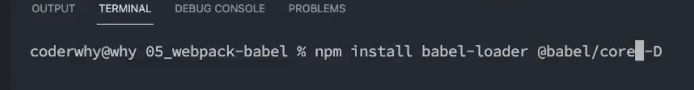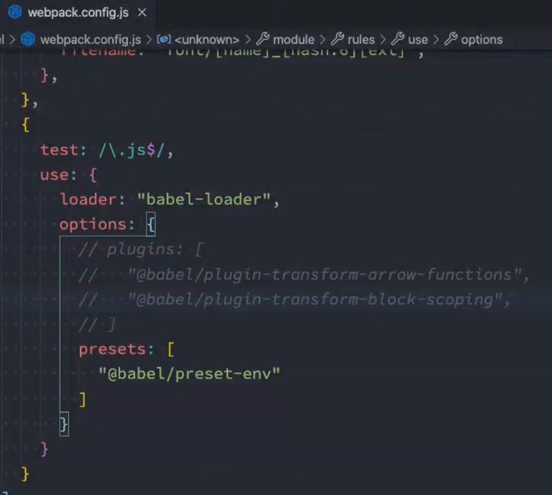

- 另外也可以通过babel.config.js的方式去配置babel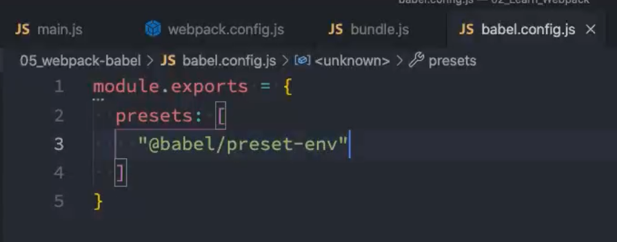

- 在js文件中对vue进行打包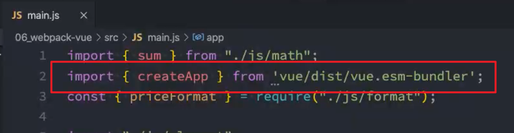

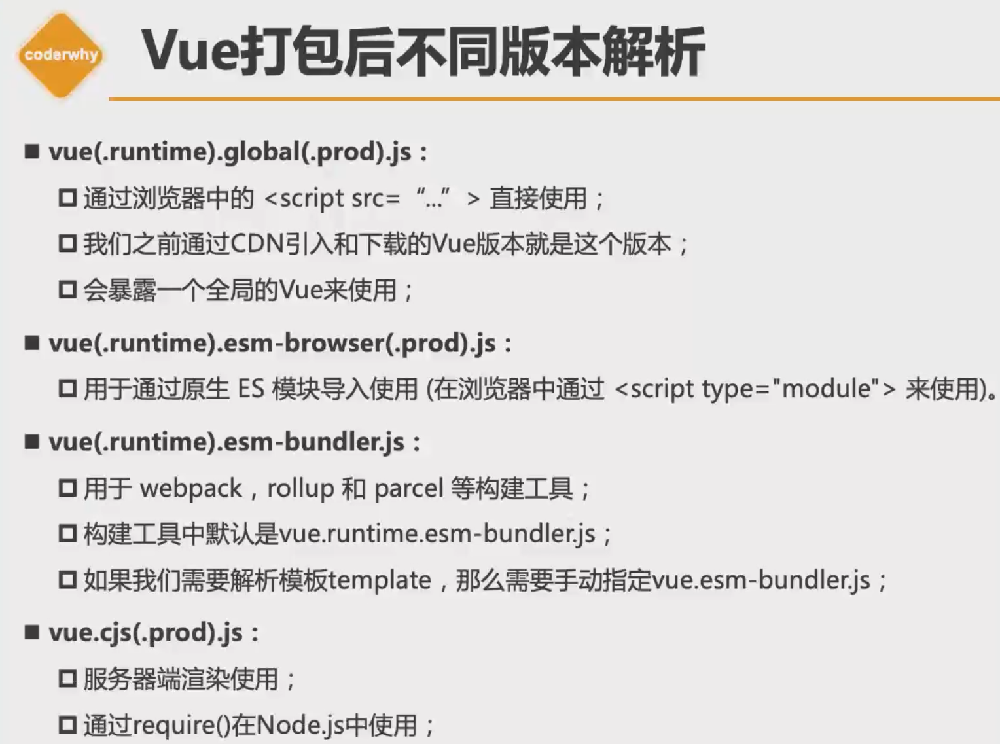

- 因为vue打包后会有很多不同的版本解析，如果使用webpack构建的话，需要对其指定`.esm-bundler.js`进行解析
- webpack自动编译，watch，热更新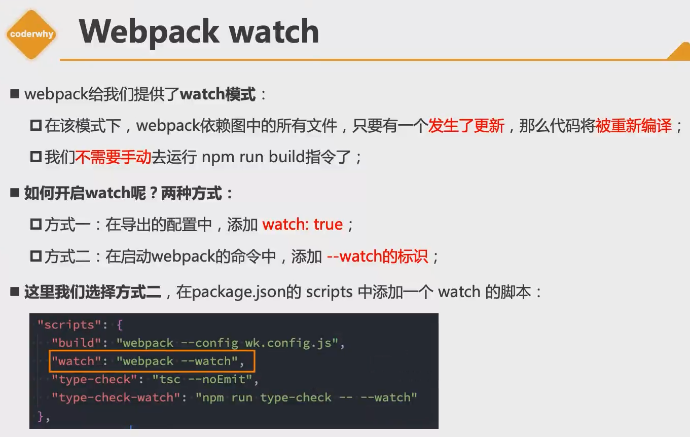

- **devserve**中contentbase属性，可以设置，如果当webpack找不到文件资源的时候，可以去contentbase目录中进行查找

#### 11.vue3 组件通讯

父子通讯中，父传子没什么特别，子传父有些许不同

- 需要在子组件中添加`emits`属性

  ```js
  export default {
      emits:["add", "sub"],
      methods: {
        increment(){
          console.log('+1');
          this.$emit("add");
        },
        decrement(){
          console.log("-1");
          this.$emit("sub");
  
        }
      },
  ```

- 在父组件中监听事件

  ```vue
  <Counter-Operation @add="increment" @sub="decrement"></Counter-Operation>
  ```

另外就是通过`provide`和`inject`进行跨组件通讯

- 在父组件中写入

  ```js
  export default {
      components:{
        home
      },
      provide:{
        name:'why',
        age:'18'
      }
    }
  ```

- 在孙子组件中写入

  ```js
  export default {
      inject:["name","age"]
    }
  ```

此时就可以在孙子组件中拿到`name`和`age`两个属性

**如果希望provide中内容为响应式：**

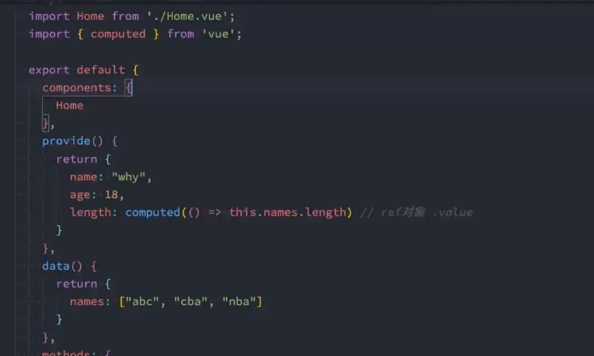

在vue3中，需要引入computed函数，设置对应的值为响应式，**注意：**此时computed会返回一个ref对象，如果想获取到正常的值，需要通过`.value`进行调用

#### 12.插槽

比较重要常用的就是作用域插槽

直接上代码

App.vue

```vue
<template>
  <div>
    <slot-test :names="names">
      <template v-slot="soltProps">
        <button >{{soltProps.item}}</button>
      </template>
    </slot-test>
  </div>
</template>

<script>
import SlotTest from './SlotTest.vue';
  export default {
    components:{
      SlotTest
    },
    data() {
      return {
        names:["甲","乙","丙"]
      }
    },
  }
</script>
<style scoped>
</style>
```

SlotTest.vue

```vue
<template>
  <div>
    <template v-for="item in names" :key="item">
      <slot :item="item"></slot>
    </template>
  </div>
</template>
<script>
export default {
  data() {
    return {};
  },
  props: {
    names: {
      type: Array,
      default: () => [],
    },
  },
};
</script>
<style scoped>
</style>
```

因为模板在编译的时候是有作用域的，在app.vue中，button虽然放在子组件中，但是他实际上会被编译到当前作用域中，也就是app.vue，所以这个button他访问不到子组件`SlotTest`的属性和方法，此时如果需要进行访问的话，就比如此时1需要进行列表渲染，展示数据，这时候就需要用到作用域插糟。

用法也比较简单，就是在子组件中对`slot`标签通过`v-bind`绑定所需要的对应的属性，在父组件中通过添加`template`标签

#### 13.动态组件

有时候会有需求，需要动态渲染某一个组件，可以根据后台返回的名称，去渲染对应的组件

此时就可以用`<component is="name"></component>`通过动态组件去渲染，动态渲染中`is`后跟的是组件名称，组件名称可以是在全局中`component`中注册的全局组件，也可以是在每个父页面中注册的局部组件`components`属性中定义的组件

#### 14.keep-alive

作为一个父级标签，将其中的子组件保持不被销毁的状态，其中有`include`属性，可以设置需要缓存的组件，其中`include`中参数为`Array`，`String`，正则，三种，其中，参数为每个组件的`name`属性名

#### 15.异步组件

为了优化首页渲染的时间，尽可能的减少单一文件的大小，可以采用异步组件的方式，将组件进行分包操作，也就是将各个组件分别进行打包，而不是打包到一个文件中，这样在请求的时候，就可以先请求主要文件，等到用到组件的时候，在去请求异步组件

在vue3中，vue提供了一种方式，可以实现异步组件

```js
const AsyncCategory = defineAsyncComponent(() => import("./AsyncCategory.vue"))
```


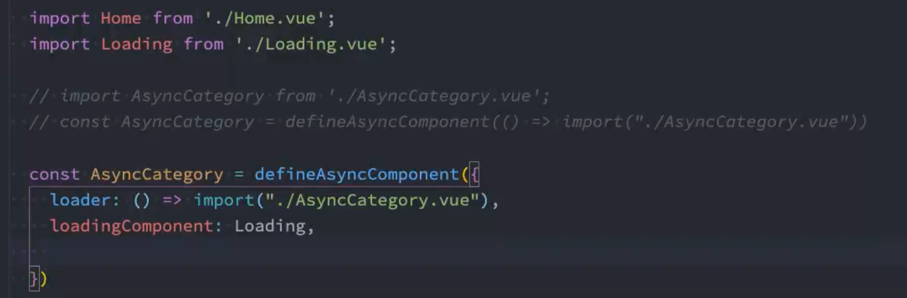

另外一种方式就是传入一个对象

开发中主要是通过路由来加载异步组件的

#### 14.$refs的使用

$refs是给元素或者组件绑定一个ref的attribute属性

通过对元素或者组件内添加`ref`属性，设置属性名，然后，该属性名就成为该元素的实例

之后就可以在函数中通过`this.$refs.名称`访问注册过`ref attribute`的所有dom元素和组件实例

#### 15.缓存组件的生命周期

actived和dectived两个生命周期钩子函数，有时候会有需求希望知道该组件是否活跃，或者说该用户是否已经切换到其他组件，这个一般是跟着`keep-alive`一起进行添加，因为添加过程中该组件不会被销毁

这两个钩子 函数从字面意思就可以看出，一个是处于活跃状态，一个是处于非活跃状态

#### 16.在组件中使用v-model

在子组件中需要通过props去注册一个`modelValue`的属性

这个东西的应用场景可以是：比如想去封装一个input组件，同时我想要在父组件中知道这个input中的值，这时候很自然得到就希望去使用`v-model`去实现一个双向绑定

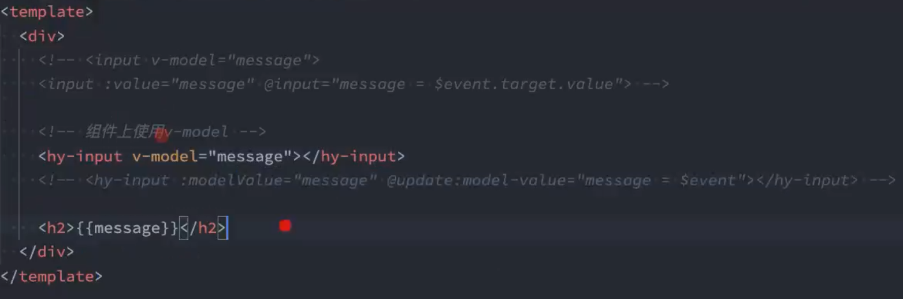

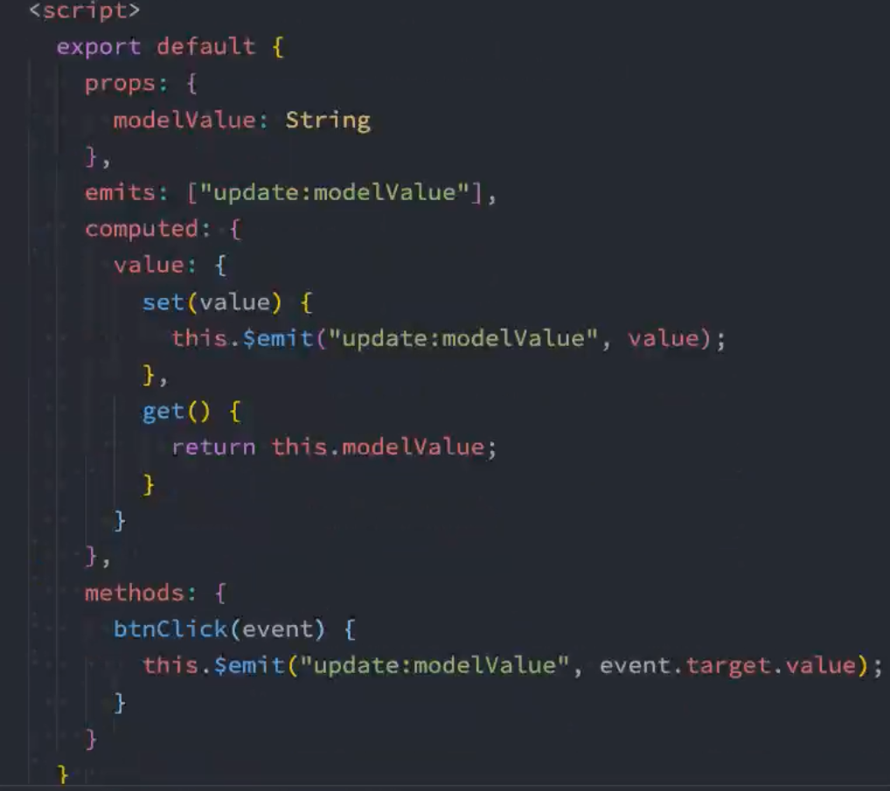

在组件上绑定`v-model`的时候，在发生更新的时候，需要去传递一个事件，这个事件是`update:modelValue`通过这个事件传回父组件

另外，如果需要对两个或者多个input进行组件的双向绑定的话，可以使用`<hyinput v-model="message" v-model:title="title"></hyinput>` 通过在`v-model`后面加上一个`:title`其中title可以任意设置，这样就可以实现双向绑定两个数据，多个数据同理

在子组件中需要传递的事件就会变成两个`update:title`和`update:modelValue`两个，同时需要在计算属性中对他进行get()，set()方法的绑定

#### 17.使用gsap库实现动画效果

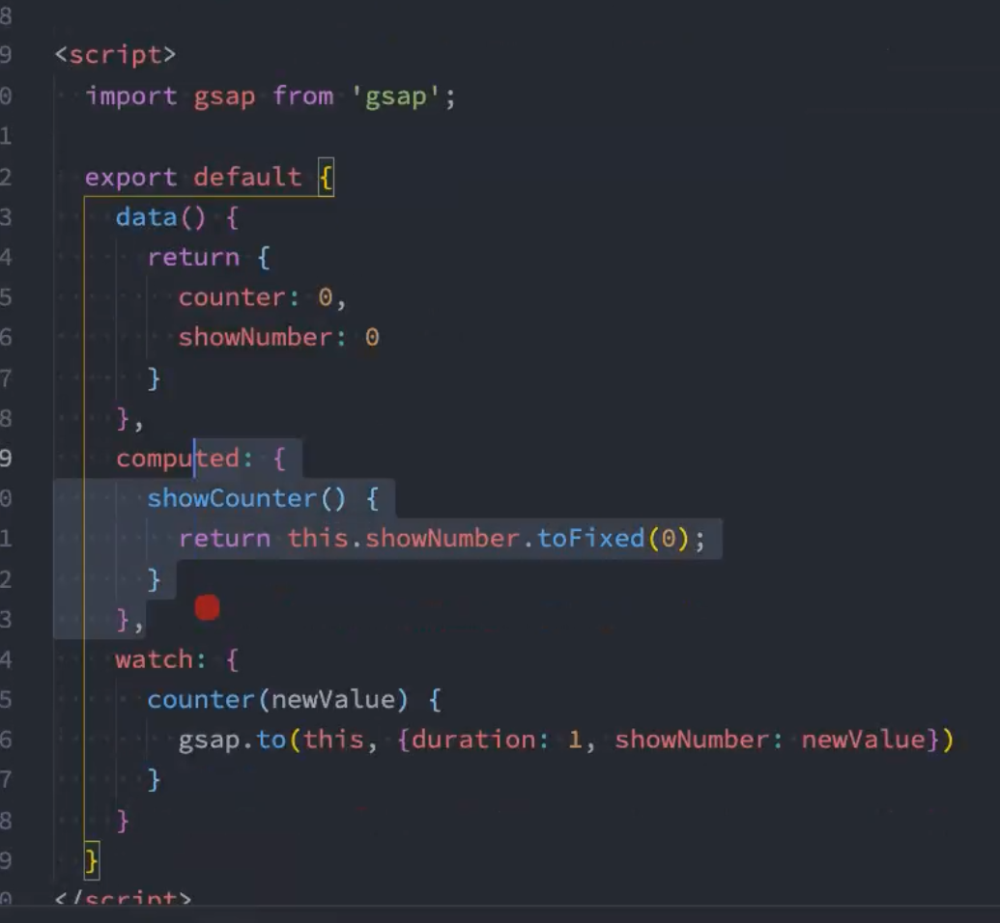

通过gsap.to()实现`0-100`缓慢增加

#### 18.transition-group

```vue
<template>
  <div>
    <button @click="addNum">添加数字</button>
    <button @click="removeNum">删除数字</button>
    <button @click="shuffleNum">数字洗牌</button>
    <transition-group tag="p" name="why">
      <span v-for="item in numbers" :key="item" class="item">
        {{item}}
      </span>
    </transition-group>
  </div>
</template>

<script>
  export default {
    data() {
      return {
        numbers:[0,1,2,3,4,5,6,7,8,9],
        numCounter:10
      }
    },
    methods: {
      addNum(){
        this.numbers.splice(this.randomIndex(),0,this.numCounter++)
      },
      removeNum(){
        this.numbers.splice(this.randomIndex(),1)
      },
      randomIndex(){
        return Math.floor(Math.random()*this.numbers.length)
      }
    },
  }
</script>

<style scoped>
.item{
  margin-right: 10px;
  display: inline-block;
}
.why-enter-from,
.why-leave-to {
  opacity: 0;
  transform: translateY(30px);
}
.why-enter-active,
.why-leave-active{
  transition: all 1s ease;
}
.why-leave-active{
  position: absolute;
}
.why-move {
  transition:transform 1s ease;
}
</style>
```

可以实现删除操作，数字向下移除，其余向左移除

#### 19.mixin混入

如果有需求，需要多个组件复用同一段代码，可以将这段代码专门封装到一个js文件中，通过export 进行导出，在需要用到的组件中使用`mixins:[]`，将文件名称填进去，就可以复用

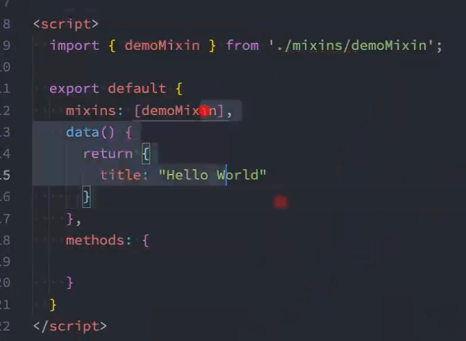

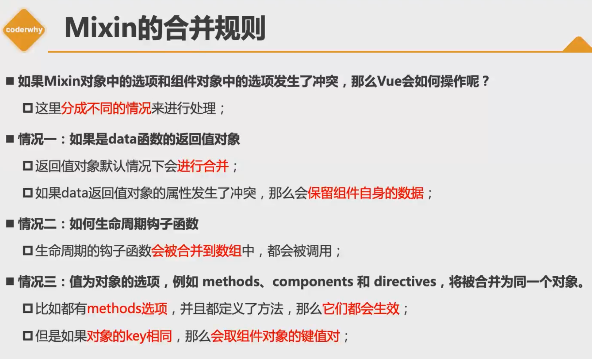

#### 20.compositionAPI的使用

vue3的特色之一就是compositionAPI的使用，主要就是通过一个setup()函数，将data，或者methonds和各种钩子函数放到setup()函数里面进行处理

此时需要注意的是，setup()函数中可以有一个返回值，会返回一个对象，其中对象的各种属性，就可以在template中使用，其中返回的可以是普通的属性，或者是函数。

这时候定义的属性不是响应式的，因为setup函数并没有对其中所有定义的普通变量进行一个响应式的绑定，所以需要手动引入函数，进行手动的绑定响应式，其中之一就是`reactive()`函数，`reactive`函数会返回一个对象，这个对象中定义的属性就是响应式的。

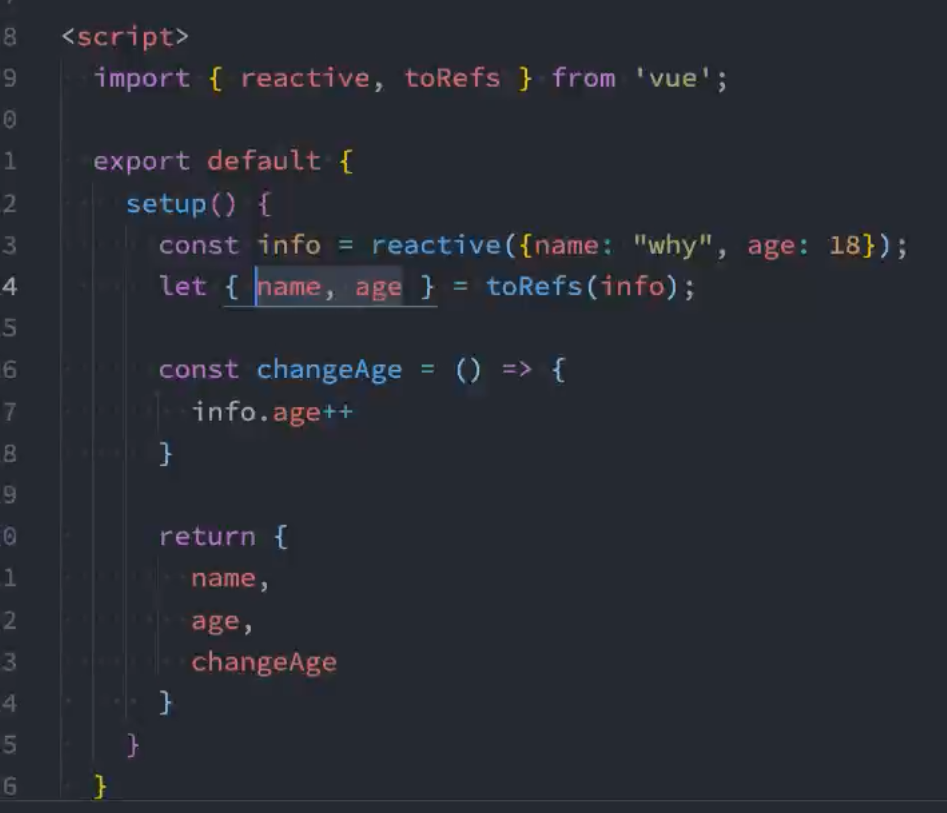

toRefs()多用于在结构中使用，因为通过解构，解构后得到的属性只是相当于赋值，并不是引用，所以并不会变成响应式，所以此时如果想解构后的函数也是响应式的，就需要通过`toRefs()`函数，对info对象当做参数传入。

#### 21.computed和watch

在需要监听一个数据变化的时候就用到了computed，在vue3中也有对应的api

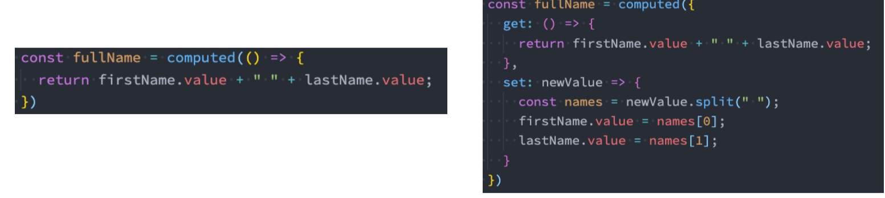侦听器：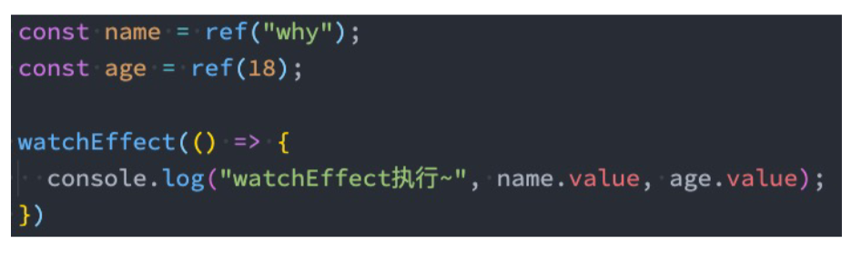

另外一个watch侦听器，可以选择两个api，一个是`wathcEffect`一个是`watch`其中`watchEffect`会立即执行传入的参数一次，目的是收集执行函数中数据的依赖，比如上图中，他会通过第一次立即调用过程中，去收集`name`，`age`的依赖

如果需要停止侦听的话，可以获取`watchEffect`的返回值函数，调用该函数就可以停止侦听

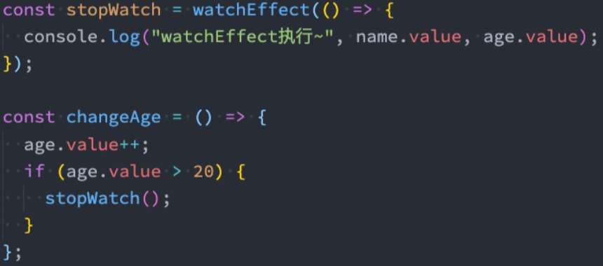

#### 22.在setup中使用ref

```js
<h2 ref="title">我是标题</h2>
setup(){
	const title = ref(null);
	return{
		title
	}
}
```

此时返回的title.value就是返回的`h2`标签对象，他会在挂载之后自动赋值给title，所以可以通过watchEffect触发

#### 23.teleport组件

组件默认是绑定到index.html的#app选择器中的，有时候不想去绑到那个地方，这时候就需要去通过

```html
<teleport to="#why"></teleport>
```

此时teleport中的内容就会被绑定到id为why的容器中

