## vue3

#### 1.v-pre

展示原始数据

#### 2.动态绑定属性名称

通过在标签中设置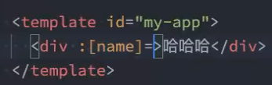

在data中设置`name`属性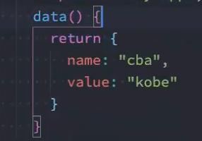

#### 3.v-bind属性直接绑定一个对象

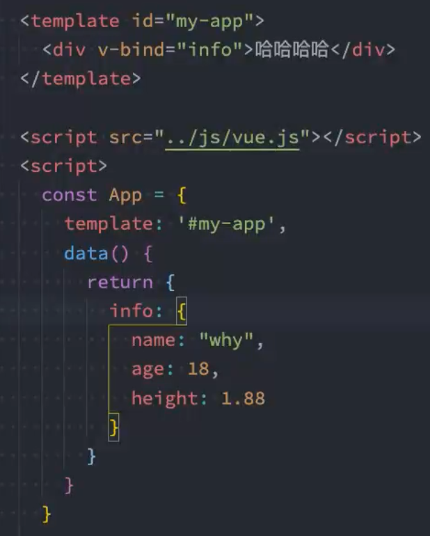

#### 4.v-on


绑定一个对象：

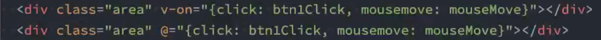

参数传递：

默认是会传递一个event对象的

```vue
methods:{
	btn2Click(event){
		console.log(event)
	}
}
```

#### 5.数组

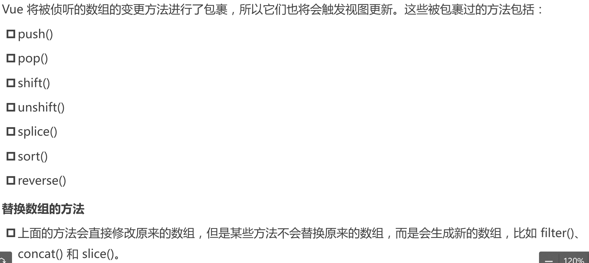

#### 6.新旧dom对比，有key和没有

没有key的操作

- 首先是对比新旧vdom节点vnode的长短，目的是对他们进行一个遍历
- 选取最短的vnode长度，对他进行一个遍历更新
- 比较新旧节点是否相同，相同就不更新，不相同就调用patch更新
- 判断新旧vNode长度，如果旧的更长，将旧的vNode更长的部分进行卸载，如果新的更长，对新的进行挂载

有key的操作

#### 7.watch的使用场景

需要监听数据的变化，比如搜索引擎的实时搜索，你输入一个字符的话，搜索引擎就会实时的进行搜索出结果

```html
<!DOCTYPE html>
<html lang="en">
<head>
  <meta charset="UTF-8">
  <meta http-equiv="X-UA-Compatible" content="IE=edge">
  <meta name="viewport" content="width=device-width, initial-scale=1.0">
  <title>Document</title>
</head>
<body>
  <div id="app">

  </div>
  <template id="my-app">
    <h2>{{info}}</h2>
    <button @click="changeMessage">改变数值</button>
  </template>
  <script src="./js/vue.js"></script>
  <script>
    const app = {
      template:'#my-app',
      data () {
        return {
          info:{
            name:'wode',
            age:18
          }
        }
      },
      watch: {
        info(newInfo,oldInfo){
          console.log(newInfo,oldInfo);
        }
      },
      methods:{
        changeMessage(){
          this.info = {name:'saberwode'}
        }
      }
    }
    Vue.createApp(app).mount('#app')
  </script>
</body>
</html>
```

此时可以发现，改变的是内存地址，也就是把一个新的对象赋值给了info，如果不改变内存地址，对该地址中的值进行改变呢？比如改变`info.name`？结论就是，默认的话，监听是进行浅层的监听，所以对`info.name`并不会产生监听。

如果想进行深度监听的时候，需要在`info`中加一个属性：`deep:true`，表示进行深度监听

```js
watch: {
        info: {
          handler: function (newInfo, oldInfo) {
            console.log(newInfo, oldInfo);
          },
          deep:true,//深度监听
          immediate:true,//立即执行
        }
      },
```

需要对info进行如上的改写，代码中，`immediate:true`表示立即执行一次

如果只想对对象中某一个属性进行监听，而不希望去监听其他属性

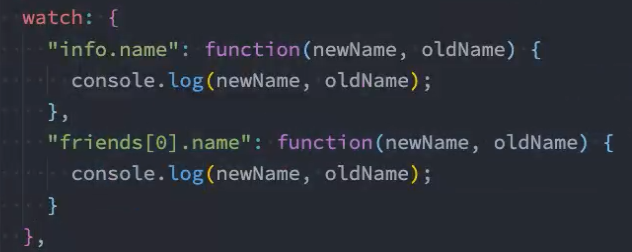

另外可以通过函数调用的方式$watch进行监听

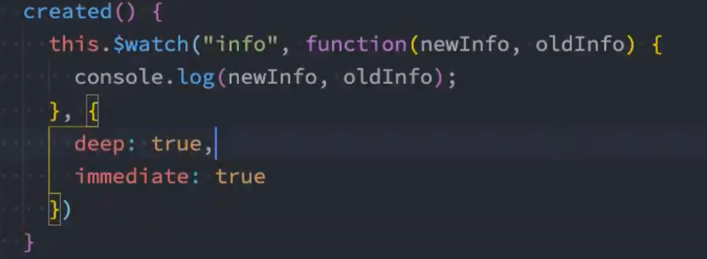

#### 8.对象的深拷贝

- 一种方法就是通过递归进行遍历，将最深的节点进行遍历，找到引用类型的，进行深层次遍历，找到值类型的，就进行复制拷贝
- 另一种就是通过`JSON.stringify()`将对象转化为字符串类型，接着通过`Json.parse()`将对象还原

- ==lodash==一个js库，也可以通过对应方法去实现深浅拷贝

#### 9.v-model

使用场景：在表单input,textarea，select元素上创建双向数据绑定（多用于表单）

相当是一个语法糖，简化操作

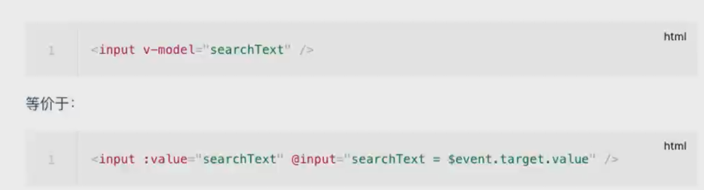

修饰符

- `.lazy`在加lazy修饰符之前，事件是通过input触发，加了之后，会通过change触发，也就是通过提交触发
- `.number`在加上之后，会自动截取输入内容为Number类型的数据，保留第一个最长的数字类型
- `.trim`去除前后空格

#### 10.webpack打包

- 可以使用全局webpack进行打包，此时可以使用`webpack`指令

- 如果想使用当前项目依赖的webpack可以使用`./node_modules/.bin/webpack`来进行操作，另外也可以使用更加简化的方法`npx webpack`进行打包

- 在实际项目中使用最多的，还是在`package.json`中的`script`标签中，加入`"build:"webpack"`

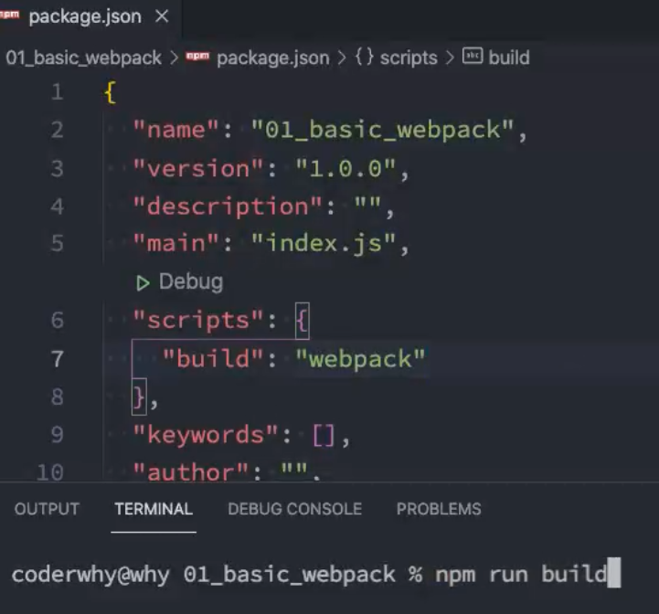

- webpack打包可以指定入口和出口：`npx webpack --entry ./src/main.js --output-path ./build`这个指令就是表示，打包的时候入口文件是`./src`的main.js文件，将打包好的文件放到出口，也就是`./build`文件夹中
- 另外可以通过新建`webpack.config.js`去在文件内部配置入口出口以及其他信息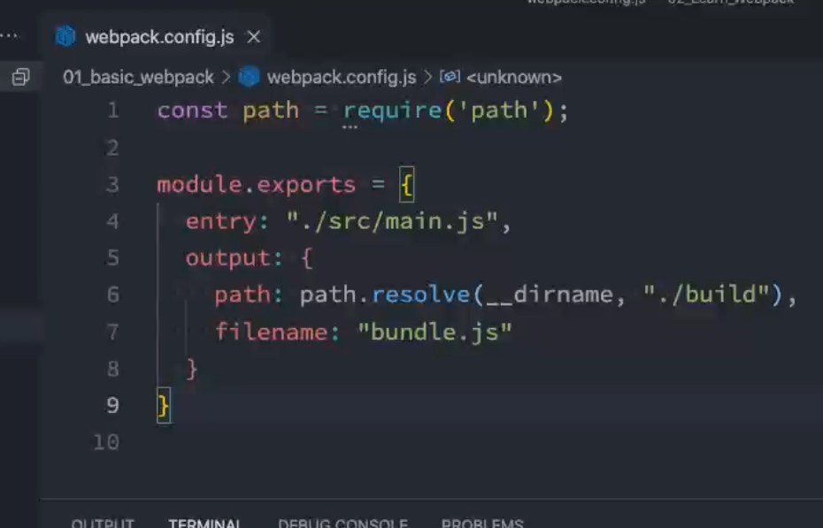

- 需要注意的是，webpack默认是不认识css文件的，所以需要使用`css-loader`
- 具体配置的话，还是在webpack.config.js中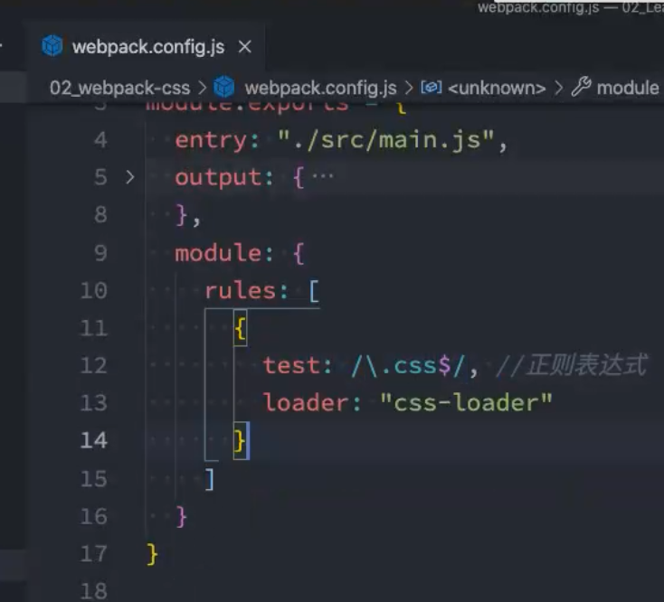
- 在css-loader加载后，相应的css文件得到了加载打包，但是并不会被渲染，此时需要使用`style-loader`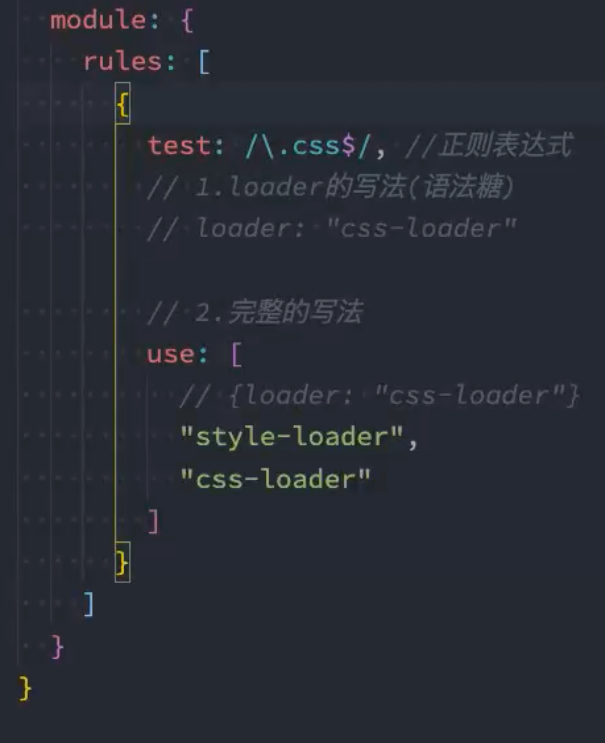

- 以上两个loader都需要通过npm下载
- 如果需要使用less的话，也需要安装less-loader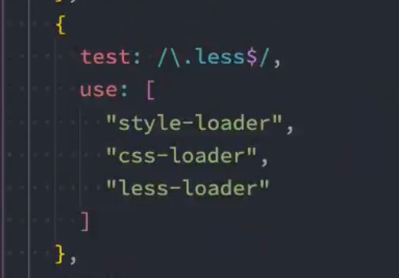

- 如果需要引入图片的话，需要安装配置使用`file-loader` 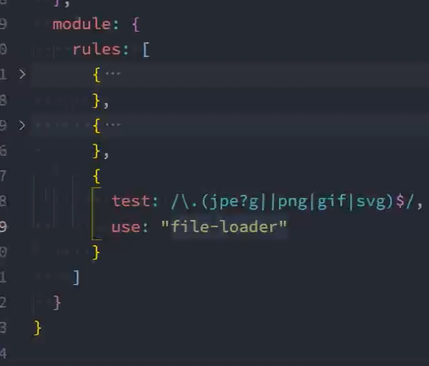

- 如果遇到需要动态添加img图片的情况，直接在`src`中写路径，webpack会把路径当成字符串处理，因而并不会将其打包，所以需要通过动态生成一个img标签，然后引入，让webpack把这个img当成一个模块来使用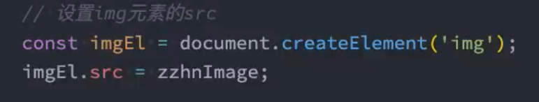

- 文件名称处理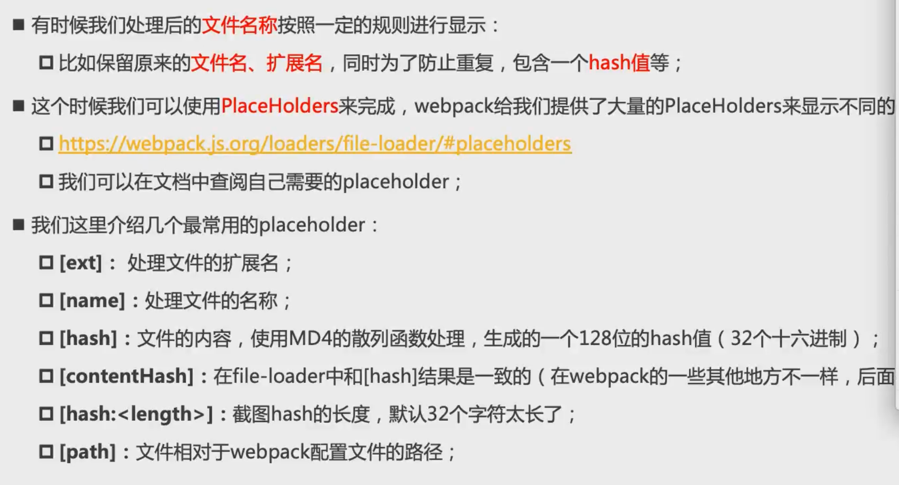

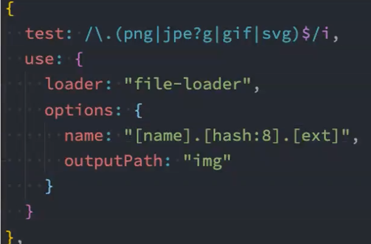

- 其中outputPath就是指定输出到哪个文件夹下
- webpack5最新打包方式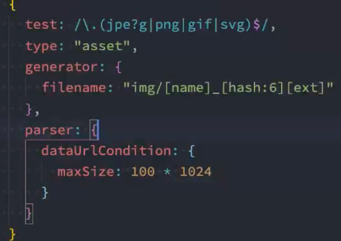

- 对于图标font，也是可以使用file-loader进行加载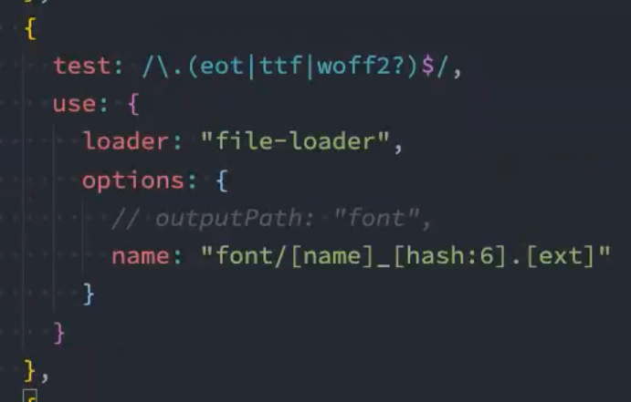
- 自动删除`/build`目录插件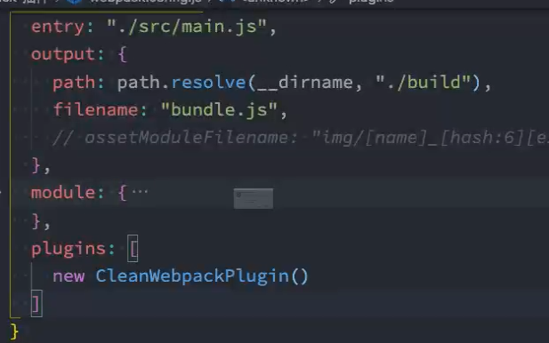

- 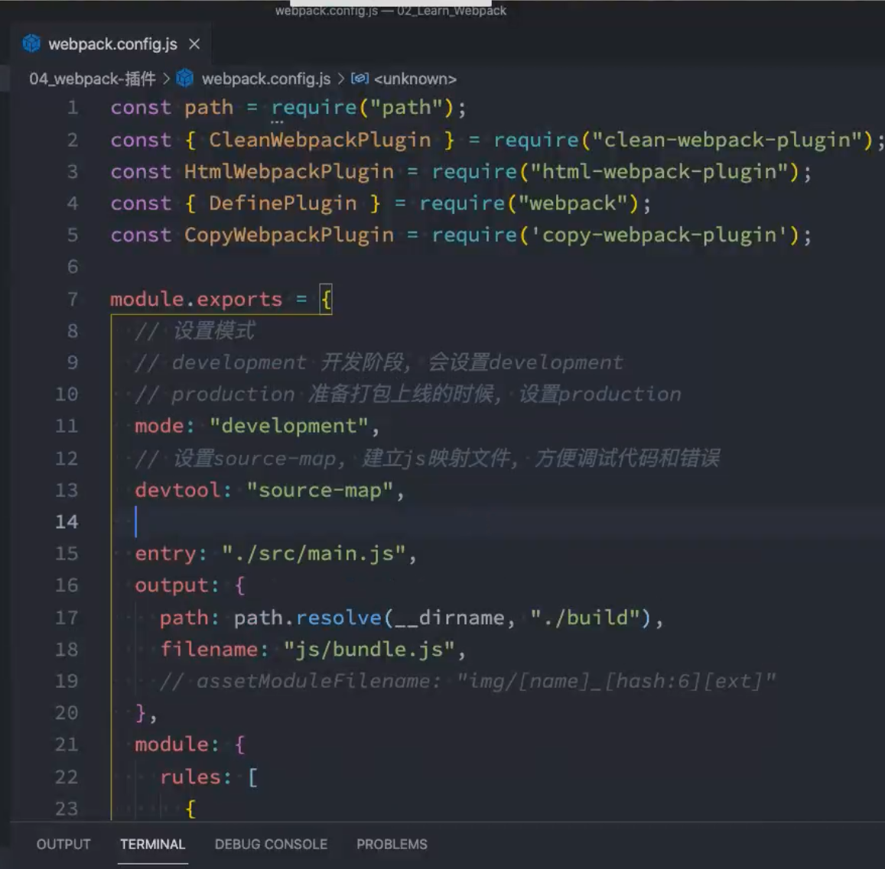

调试模式

1. Babel是一个工具链，用于将代码转化为旧浏览器可以是用的js代码，包括对typescript等语法的转化等

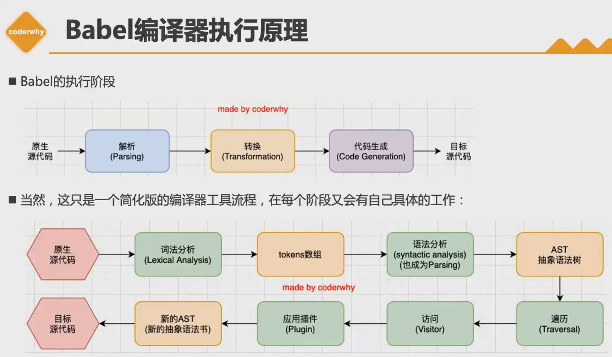

