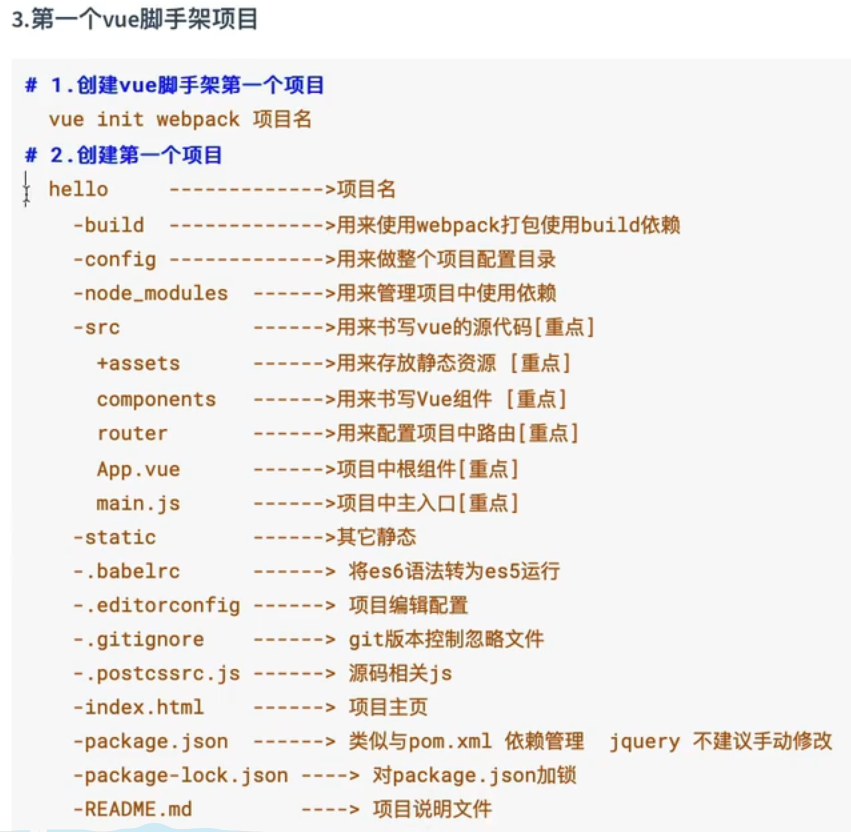
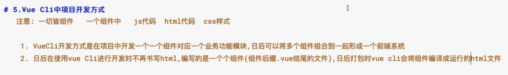

## 5.22

#### 1.Vue CLI目录：

hello						//项目名

​	-build					//用来使用webpack打包build依赖

​	-config					//用来做整个项目配置目录

​	-node_modules	//用来管理项目中使用的依赖

​	-src							//用来书写vue的源代码【重点】

​		-assets					//用来存放静态资源【重点】

​		-components		//用来书写vue组件【重点】

​		-router					//用于配置项目中的路由【重点】

​		-App.vue				//项目中的根组件【重点】

​		-main.js					//项目中的主入口【重点】

#### 2.在main.js中，开头

`import Vue from 'Vue'`	//从node_modules中引入vue.js文件，应该就是以前不用脚手架的时候`<script scr='vue.js'>`中的内容是一样的效果。

`import App from './App'` //引入自定义的组件，就是那个App.vue 十分显眼

`import router from './router'` //引入路由