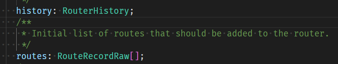
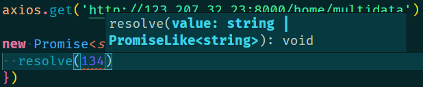
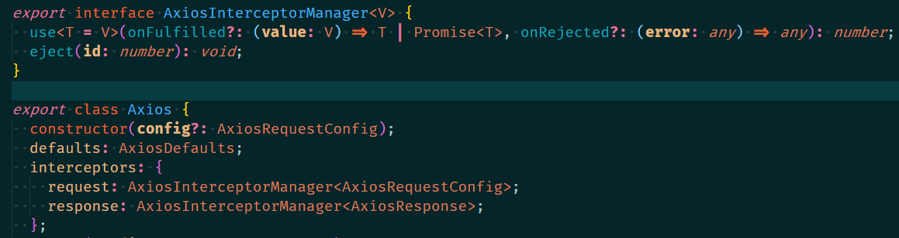

## vue3+ts后台管理

#### 1.项目搭建配置文件

在搭建项目的时候会统一规范，比如统一编辑器中的`tab`键的空格数目，还有对于代码格式的美化，通过`.prettierrc`文件设置

```json
{
  "useTabs": false,
  "tabWidth": 2,
  "printWidth": 80,
  "singleQuote": true,
  "trailingComma": "none",
  "semi": false
}

```

* useTabs：使用tab缩进还是空格缩进，选择false；
* tabWidth：tab是空格的情况下，是几个空格，选择2个；
* printWidth：当行字符的长度，推荐80，也有人喜欢100或者120；
* singleQuote：使用单引号还是双引号，选择true，使用单引号；
* trailingComma：在多行输入的尾逗号是否添加，设置为 `none`；
* semi：语句末尾是否要加分号，默认值true，选择false表示不加；

通过`.editorconfig`文件配置编辑器

```
# http://editorconfig.org

root = true

[*] # 表示所有文件适用
charset = utf-8 # 设置文件字符集为 utf-8
indent_style = space # 缩进风格（tab | space）
indent_size = 2 # 缩进大小
end_of_line = lf # 控制换行类型(lf | cr | crlf)
trim_trailing_whitespace = true # 去除行首的任意空白字符
insert_final_newline = true # 始终在文件末尾插入一个新行

[*.md] # 表示仅 md 文件适用以下规则
max_line_length = off
trim_trailing_whitespace = false
```

此时通过保存就可以自动格式化代码，如果想要更加简单，省去手动保存的步骤，就需要对webpack进行配置


#### 2.vue.config.js配置

vue.config.js默认是通过`module.exports`进行导出的，因为这些文件都是在node环境下运行的，node是支持common.js的。 

配置方式有以下几种

```
module.exports = {
	//1.根据cli提供的属性进行配置
	outputDir: './build',
	//2.和webpack属性名字保持一致，当configureWebpack的值是对象的形式，那么最后会通过webpack-merg进行合并
	configureWebpack: {
		resolve: {
			alias: {
				components: '@/components'
			}
		}
	}
	//3.如果configureWebpack的值是一个函数，那么最后会原webpack同名配置进行覆盖
	configureWebpack: (config) => {
		config.reslove.alias = {
			//因为要重写，所以此时并没有对src进行配置@ 
			
		}
	}
	//4.通过chainWebpack进行链式配置
	chainWebpack: (config) => {
		config.resolve.alias.set('@', path.resolve(__dirname, 'src')).set('components', '@/components')
	}
}

```


#### 3.初始化vue-router

```ts
//首先从vue-router中引入创建路由所需要的文件
import { createRouter, createWebHashHistory, RouteRecordRaw } from 'vue-router'
//创建routes对象
const routes: RouteRecordRaw[] = [
  {
    path: '/',
    redirect: '/login'
  },
  {
    path: '/login',
    component: () => import('@/views/login/Login.vue')
  },
  {
    path: '/main',
    component: () => import('@/views/main/Main.vue')
  }
]
//通过createRouter进行创建路由
const router = createRouter({
	routes: routes,
	history: createWebHashHistory()
})
//将创建好的路由导出
export default router
```

因为是使用ts，所以需要对routes进行类型限制，可以通过`interface`对routes进行手动设置

但是因为`routes`对象是作为`createRouter`函数的一个参数，所以在createRouter中已经对其进行了类型限制，通过`ctrl+左键`点进去可以找到routes的类型为`routes: RouteRecordRaw[];`

所以需要对routes进行类型设置

最后需要在`main.ts`文件中对导出的`router`进行注册

`app.use(router)`


#### 4.初始化vuex

```ts
//1.首先导入vuex创建函数
import { createStore } from 'vuex'
//2.创建store
const store = createStore({
	state: () => {
		return {
			name: 'saberwode'
		}
	},
  	mutations: {},
 	getters: {},
 	actions: {}
})
//3.导出store
export default store
```

最后需要在`main.ts`文件中对导出的`vuex`进行注册`app.use(store)`


#### 5.按需引入element-plus

需要下载插件`npm install babel-plugin-import -D`

不太需要按需引入

#### 6.环境配置

如果遇到需要切换环境的情况，比如生产、开发、测试环境，可以通过`process.env.NODE_ENV`这个语句进行判断，webpack在打包的时候会将当时的环境通过`DefinePlugin`插件注入到这个语句中，`process.env.NODE_ENV`在开发环境的值为`development`，在生产环境的值为`production`，在测试环境的值为`test` 

另外，在vue-cli脚手架的环境下，可以通过在根目录上创建`.env.development`、`.env.production`、`.env.test`三个文件，文件内部中文件命名需要按照以以下格式`VUE_APP_随意内容`，然后通过`process.env.VUE_APP_随意内容`取到

#### 7.ts封装axios

> #### ts相关

`Promise`本身是可以有类型的，在ts中

```ts
new Promise<string>((resolve, reject) => {
	//此时，resolve中的参数必须是string类型
	resolve('123')
}).then((res) => {
  console.log(res.length)
})
```

如果通过泛型传入其他类型的，例如




提示中就指出传入的参数需要是`string`或者`promiselike<string>`,此时的泛型所指定的<string>也表明`.then()`中的res参数类型也是string类型，所以在之后的回调函数中就可以看到`res.length`的属性提示

在axios的声明文件中看到这样的代码

```ts
export interface AxiosInstance extends Axios {
  (config: AxiosRequestConfig): AxiosPromise;
  (url: string, config?: AxiosRequestConfig): AxiosPromise;
}
```

上面代码的第二行表示，`(config: AxiosRequestConfig)`是一个函数，他的类型是`AxiosPromise`类型，这里面比较特殊的就是这个函数并没有定义函数名，只要是参数类型符合规则的，就是相应的类型

```ts
export interface AxiosInterceptorManager<V> {
  use<T = V>(onFulfilled?: (value: V) => T | Promise<T>, onRejected?: (error: any) => any): number;
  eject(id: number): void;
}
```

上述代码中，接口`AxiosTnterceptorManager`中传入了一个泛型`V`。这个接口中定义了一个名为`use`的函数，`use`函数也传入了一个泛型`T`这个泛型类型是`V`，同时`use`函数中也有也有两个指定名字的函数作为参数`onFulfilled`与`onRejected`

#### 

> #### 正式封装axios

1. 这里为了封装axios创建了一个`service`文件夹，该文件夹的入口文件为`index.ts`

   ```ts
   import XRequest from './request'
   import { BASE_URL, TIME_OUT } from './request/config'
   
   const xRequest = new XRequest({
     baseURL: BASE_URL,
     timeout: TIME_OUT
   })
   export default xRequest
   ```

   该文件导出了已经封装好了的`xRequest` ~~(随意命名的，yylx最后字母命名的)~~ 

   之后在`request`文件夹中编写`XRequest`类，用来封装axios

2. 为了解决当有多个不同`base_url`需要进行网络请求的问题，在`XRequest`类中创建了`instance`用于保存`axios`实例

   ```ts
   import axios from 'axios'
   import type { AxiosInstance, AxiosRequestConfig } from 'axios'
   
   class XRequest {
     // 创建一个axios实例
     instance: AxiosInstance
     constructor(config: AxiosRequestConfig) {
       // 在创建xRequest实例的时候，传入config，之后赋值给该实例的instacne
       // 这样就可以保证每个xRequest实例保持独立，当BASE_URL不同的时候，每个xRequest实例发送请求时互不干扰
       this.instance = axios.create(config)
     }
     request(config: AxiosRequestConfig): void {
       // 这里的instance就相当于一个axios实例，他有axios实例可以拥有的所有方法
       this.instance.request(config).then((res) => {
         console.log(res)
       })
     }
   }
   
   export default XRequest
   ```

   这里需要注意的是在构造函数`constructor`中的参数`config`的类型如何确定：因为`config`要作为`axios.create()`的参数传递进去，所以要符合这个函数的参数类型规定，这个类型在`axios`的ts声明文件中有定义，可以直接拿过来用

3. 在axios实例创建好之后，就可以封装request请求了，通过`this.instance.request(config).then(res=>{})`，之后通过`xRequest.request(config)`就可以实现通过封装的axios发送网络请求

4. > 下面就是重头戏添加拦截器

   封装好的`XRequest`类希望可以传入`interceptors`拦截器，同时也可以传入`AxiosRequestConfig`类型的属性，所以此时传入的`config`就不能是`AxiosRequestConfig`类型了，需要自定义一个接口`XRequestConfig`类型去包括`AxiosRequestConfig`和`interceptors`属性

   ```ts
   interface XRequestConfig extends AxiosRequestConfig {
   	interceptors?: XRequestInterceptors 
   }
   ```

   然后需要确定拦截器中有哪些属性

   ```ts
   interface XRequestInterceptors {
   	// 这里面的config类型可以从this.instance.interceptors.request.use()中查看
   	requestInterceptor?: (config: AxiosRequestConfig) => AxiosRequestConfig
   	requestInterceptorCatch?: (error: any) => any
       // 这里的congfig类型查看地方同上
       responseInterceptor?: (config: AxiosResponse) => AxiosResponse
       responseInterceptorCatch?: (error: any) => any
   }
   ```

   

   接口类型出处：当调用`use()`方法的时候，其参数类型就被规定了，其中传入的泛型`V`，就是`config`的类型

5. 完整的封装类XRequest

   ```ts
   class XRequest {
     // 创建一个axios实例
     instance: AxiosInstance
     interceptors?: XRequestInterceptors
     // 自定义的接口类型，除了AxiosRequestConfig，还有额外的可选拦截器属性
     constructor(config: XRequestConfig) {
       // 在创建xRequest实例的时候，传入config，之后赋值给该实例的instacne
       // 这样就可以保证每个xRequest实例保持独立，当BASE_URL不同的时候，每个xRequest实例发送请求时互不干扰
       this.instance = axios.create(config)
       this.interceptors = config.interceptors
       this.instance.interceptors.request.use(
         this.interceptors?.requestInterceptor,
         this.interceptors?.requestInterceptorCatch
       )
       this.instance.interceptors.response.use(
         this.interceptors?.responseInterceptor,
         this.interceptors?.responseInterceptorCatch
       )
     }
     request(config: AxiosRequestConfig): void {
       // 这里的instance就相当于一个axios实例，他有axios实例可以拥有的所有方法
       this.instance.request(config).then((res) => {
         console.log(res)
       })
     }
   }
   ```

   这时候就可以在`service/index.ts`中在实例化的时候传入拦截器了

   

   

   


