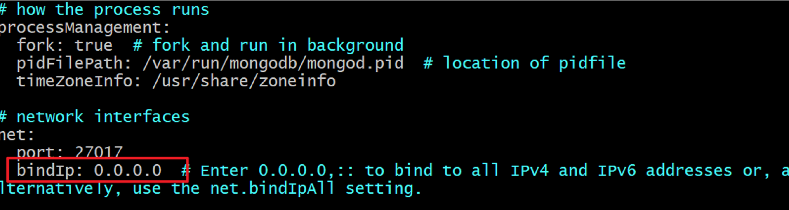
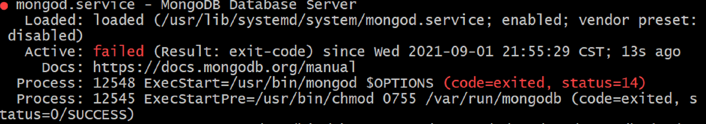

> ## 这个服务器真的离了个大谱

#### 1.mongodb安装问题：

就正常安装就行，可以按照官网

这里面主要说上一个坑

如果你想要外网也能连接到你的服务器，你需要在`/etc/mongod.config`中，通过`vim /etc/mongod.config`去修改`bind_ip`为`0.0.0.0`



比如这样，然后坑就来了

当你想启动服务器的时候，会产生类似于



的报错

这时候只需要运行

```shell
sudo chown -R mongod:mongod /var/lib/mongo
sudo sudo chown -R mongod:mongod /var/lib/mongo
sudo sudo chown -R mongod:mongod /var/log/mongodb
sudo sudo chown mongod:mongod /tmp/*.sock
```

修改文件的权限就可以了

接着就可以重启了