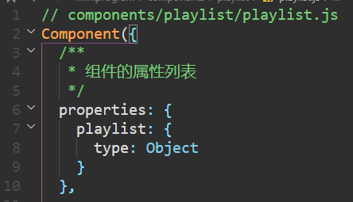

## 云开发音乐

视频进度：2-5 10:57

#### 1.清除默认的pages

在pages中会有很多示例，首先需要在`app.json`中将对应的`pages`选项给删除掉，另外需要注意的是，在`pages`数组中添加的路径，在保存之后，会自动生成相应的目录和文件，但是删除不会，所以需要手动去删除

#### 2.新版本的cloudfunctions

新版的cloudfunctions中的文件夹会有所不同，其中会有一个`quickstartFunctions`文件夹，如果想要获取相应的云函数，需要在原来的基础上添加`data`选项，然后添加`type`。这些在示例文件中都写的很清楚

#### 3.tabBar

在`app.json`中配置tabBar属性，可以设置小程序底部的三个按钮。

```json
"tabBar": {
    "color": "#474747",
    "selectedColor": "#d43c43",
    "list": [{
      "pagePath": "pages/playlist/playlist",
      "text": "音乐",
      "iconPath": "images/music.png",
      "selectedIconPath": "images/music-active.png"
    },
    {
      "pagePath": "pages/blog/blog",
      "text": "发现",
      "iconPath": "images/blog.png",
      "selectedIconPath": "images/blog-active.png"
    },
    {
      "pagePath": "pages/profile/profile",
      "text": "我的",
      "iconPath": "images/profile.png",
      "selectedIconPath": "images/profile-active.png"
    }
  ]
  },
```

其中`pagePath`是代表这个tabBar对应的是哪个页面、text是文本内容、iconpath就是图片地址、selectediconpath就是选中后的图标地址。color是文本颜色，selectedcolor是选中后的文本颜色

#### 4.组件化开发

在`miniprogram`中的`components`文件夹中，创建需要的组件，然后在组件文件夹中右键选择新建components，此时会自动生成4个文件。至此一个组件制作完成

接下来就是使用组件：

跟vue类似，在需要组件的`wxml`文件中，首先需要在其`json`文件中配置`usingComponents`属性，配置组件名称和组件路径

```json
{
  "usingComponents": {
    "yylx-playlist": "/components/playlist/playlist"
  }
}
```

然后就可以在`wxml`文件中通过该组件名使用该组件

```html
<view class="playlist-container">
  <block wx:for="{{playlist}}">
    <yylx-playlist playlist="{{item}}"></yylx-playlist>
  </block>
</view>
```

向组件中传值是通过以上代码的方式，其中`yylx-playlist`标签中的`playlist`属性，需要在`playlist.js`文件中进行定义

之后就可以接受到传递过来的值

#### 5.发送axios请求

需要在当前云函数中用终端打开，然后下载axios `npm install axios`

引入axios `const axios = require('axios')`

通过`axios`发送get请求，返回data数据

#### 6.云数据库操作

注册云数据库实例`const db = cloud.database()`

获取云数据库中集合实例`const playlistCollection = db.collection('playlist')`

接着就可以对云数据库进行操作`constResult = await playlistCollection.count()`

`let promise = playlistCollection.skip(i * MAX_LIMIT).limit(MAX_LIMIT).get()`

这个就是典型的分页获取，因为云数据库一次可以供请求的数量有限，所以必须要分批次进行请求

插入数据`await playlistColletion.add()`

#### 7.渲染页面

通过云函数调用云数据库返回数据，将获取的数据进行渲染页面

另外需要注意的是，用户的下拉操作需要提前在`.json`文件中进行设置为`true`

#### 8.云函数路由tcb-router

因为云函数目前最多只能创建50个云函数，如果随着项目的复杂度增加，会导致云函数的数量不够用，所以类似的请求可以归类到同一个云函数进行处理

该云函数路由是一个第三方库，需要通过`npm`进行下载，该路由是一个koa风格的云函数路由库，所以就可以使用类似的洋葱模型中间件形式进行编写代码

#### 9.页面跳转功能

点击歌单，跳转到歌单列表页面

通过bindtap绑定点击事件，在`playlist.js`中写对应事件触发函数，通过`wx.navigateTo({url: "../../pages/musiclist/musiclist?playlistId=${this.properties.playlist.id}"})`进行跳转，并且传入当前歌单的id

#### 10.歌曲组件musiclist

目前已经实现歌单的渲染，下面就是点击对应的歌单，进入对应的歌单界面渲染musiclist

歌曲列表组件分为两部分，头部的图片背景和文字描述，下方的歌曲列表。

歌曲列表组件通过新建组件实现，通过创建云函数，将获取到的playlistId歌单id传入，请求到该歌单的歌曲列表然后返回


