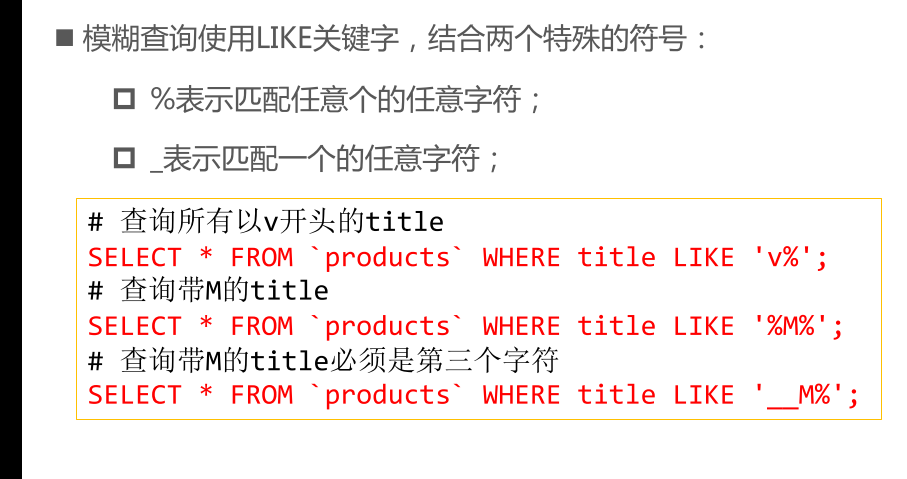
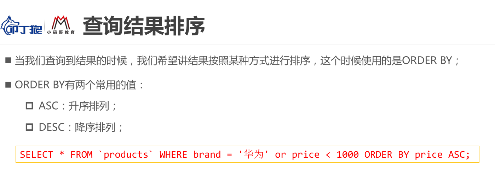

## 数据库知识点

#### 1.基本操作

- 显示数据库

```
show databases
```

- 创建数据库

```
CREATE DATABASE IF NOT EXISTS douyu ;
```

- 使用数据库

```
USE bili;
```

- 删除数据库

```
DROP DATABASE if EXISTS douyu;
```

#### 2.约束

unique：单一，该字段只能出现一次

AUTO_INCREMENT 不设置值时可以递增

#### 3.修改表

修改表名：

ALTER TABLE `user` RENAME to `users`
添加新字段：

ALTER TABLE `user` ADD updateTime TIMESTAMP

改变字段名称：

ALTER TABLE `user` CHANGE phoneNum telPhone VARCHAR(20)

修改字段类型：

ALTER TABLE user MODIFY name VARCHAR(30)

删除字段：

ALTER TABLE user drop age

复制表结构，包括主键：

CREATE TABLE user2 like user

复制表内容：

CREATE TABLE user3 (SELECT * FROM user)

#### 4.自动设置更新时间

默认值：

ALTER TABLE user MODIFY createTime TIMESTAMP DEFAULT CURRENT_TIMESTAMP;

更新时更新时间：

ALTER TABLE user MODIFY updateTime TIMESTAMP DEFAULT CURRENT_TIMESTAMP ON UPDATE CURRENT_TIMESTAMP;

#### 5.插入数据

INSERT INTO user (name,telPhone) VALUES ('lucy', '000-11231231')






#### 6.添加外键约束

添加外键

```sql
ALTER TABLE `products` ADD FOREIGN KEY(brand_id) REFERENCES brand(id);
```

当主键被外键所引用时，默认是不能被修改的，需要在创建时对其进行设定

```sql
#1.获取到目前外键的名称，可以自己设置
#此时获取的是类似反编译获取到的创建表的语句，
SHOW CREATE TABLE `products`;
#代码如下
-- CREATE TABLE `products` (
--   `id` int NOT NULL AUTO_INCREMENT,
--   `brand` varchar(20) DEFAULT NULL,
--   `title` varchar(100) NOT NULL,
--   `price` double NOT NULL,
--   `score` decimal(2,1) DEFAULT NULL,
--   `voteCnt` int DEFAULT NULL,
--   `url` varchar(100) DEFAULT NULL,
--   `pid` int DEFAULT NULL,
--   `brand_id` int DEFAULT NULL,
--   PRIMARY KEY (`id`),
--   KEY `brand_id` (`brand_id`),
--   CONSTRAINT `products_ibfk_1` FOREIGN KEY (`brand_id`) REFERENCES `brand` (`id`)
-- ) ENGINE=InnoDB AUTO_INCREMENT=109 DEFAULT CHARSET=utf8mb4 COLLATE=utf8mb4_0900_ai_ci

#2.拿到外键名称之后，将外键删除
ALTER TABLE `products` DROP FOREIGN KEY products_ibfk_1;
#3.重新添加外键约束
ALTER TABLE `products` ADD FOREIGN KEY (brand_id) REFERENCES brand(id)																	ON UPDATE CASCADE																		ON DELETE RESTRICT;
```

在上述第三步添加外键约束中，给外键设置的属性值有 `on update cascade`和`on delete restrict`

其中cascade是：如果该主键有其他外键关联，修改时，会连带其他外键一起修改，删除也是会连带删除，所以一般删除是不会使用cascade的，一般使用默认，但是更新明显他更好使

#### 7.多表查询

```sql
# 4.查询的需求
# 4.1. 查询所有有选课的学生，选择了哪些课程
SELECT stu.id id, stu.name stuName, stu.age stuAge, cs.id csId, cs.name csName, cs.price csPrice
FROM `students` stu
JOIN `students_select_courses` ssc ON stu.id = ssc.student_id
JOIN `courses` cs ON ssc.course_id = cs.id;


# 4.2. 查询所有的学生的选课情况
SELECT stu.id id, stu.name stuName, stu.age stuAge, cs.id csId, cs.name csName, cs.price csPrice
FROM `students` stu
LEFT JOIN `students_select_courses` ssc ON stu.id = ssc.student_id;

# 4.3. 哪些学生是没有选课
SELECT stu.id id, stu.name stuName, stu.age stuAge, cs.id csId, cs.name csName, cs.price csPrice
FROM `students` stu
LEFT JOIN `students_select_courses` ssc ON stu.id = ssc.student_id
LEFT JOIN `courses` cs ON ssc.course_id = cs.id
WHERE cs.id IS NULL;

# 4.4. 查询哪些课程是没有被选择的
SELECT stu.id id, stu.name stuName, stu.age stuAge, cs.id csId, cs.name csName, cs.price csPrice
FROM `students` stu
RIGHT JOIN `students_select_courses` ssc ON stu.id = ssc.student_id
RIGHT JOIN `courses` cs ON ssc.course_id = cs.id
WHERE stu.id IS NULL;;

# 4.5. 某一个学生选了哪些课程（why）
SELECT stu.id id, stu.name stuName, stu.age stuAge, cs.id csId, cs.name csName, cs.price csPrice
FROM `students` stu
LEFT JOIN `students_select_courses` ssc ON stu.id = ssc.student_id
LEFT JOIN `courses` cs ON ssc.course_id = cs.id
WHERE stu.id = 2;


```

#### 8.将查询到的数据转化为JSON

```sql
# 将联合查询到的数据转成对象（一对多）
SELECT 
	products.id id, products.title title, products.price price,
	JSON_OBJECT('id', brand.id, 'name', brand.name, 'website', brand.website) brand
FROM `products`
LEFT JOIN `brand` ON products.brand_id = brand.id;

# 将查询到的多条数据，组织成对象，放入到一个数组中(多对多)
SELECT 
	stu.id, stu.name, stu.age,
	JSON_ARRAYAGG(JSON_OBJECT('id', cs.id, 'name', cs.name, 'price', cs.price))
FROM `students` stu
JOIN `students_select_courses` ssc ON stu.id = ssc.student_id
JOIN `courses` cs ON ssc.course_id = cs.id
GROUP BY stu.id;

SELECT * FROM products WHERE price > 6000;
```

其中，JSON_ARRAYAGG()要做的是将后面的多个数据转化为一行数组格式的JSON数据，这个函数负责将他转化为数组，()内的JSON_OBJECT负责将内容转化为JSON格式

#### 9.修改数据（update）

修改和删除外键引用的id

UPDATE `brand` SET `id` = 100 WHERE `id` = 1;

```sql
# 修改数据 
# 会修改表中所有的数据 
UPDATE `products` SET `title` = 'iPhone12', `price` = 1299.88; 
# 会修改符合条件的数据
UPDATE `products` SET `title` = 'iPhone12', `price` = 1299.88 WHERE `title` = 'iPhone';
```

#### 10.删除数据（delete）

```sql
# 删除数据 
# 会删除表中所有的数据 
DELETE FROM `products`; 
# 会删除符合条件的数据
DELETE FROM `products` WHERE `title` = 'iPhone';
```

