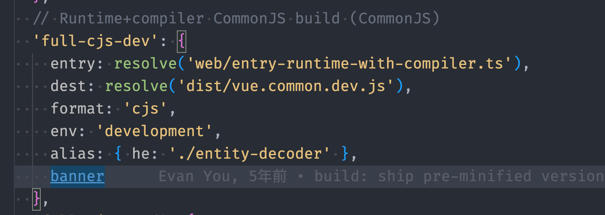
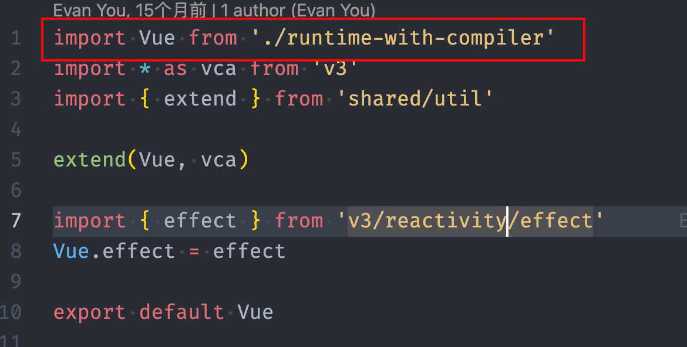

## vue源码

#### 1. runtime only和 runtime + compiler

这俩主要区别就是第一个不支持在`.js`文件中使用`template`模板语法比较轻量级，构建的文件大小会更小，运行更快，但是可以识别`.vue`文件的`template`，可以使用`render`函数，第二个可以使用`template`模板语法

第二种方式也是适用大多数的，也是官方默认推荐的配置

#### 2. vue入口

vue入口主要就是通过function的方式去实现一个class，之后为这个类去添加各种属性和方法，扩展配置

#### 3. vue为什么必须要通过new实例化

在`src/core/instance/index.ts`中通过function定义了Vue的类实现

```js
function Vue(options) {
  // this instanceof Vue 表示会检测this是否是Vue的实例
  // 此时只有通过new Vue才会创建出Vue的实例
  // 如果直接使用 Vue(options)，则this会是window，这一步主要就是为了满足
  // 必须通过new 实例化Vue
  if (__DEV__ && !(this instanceof Vue)) {
    warn('Vue is a constructor and should be called with the `new` keyword')
  }
  this._init(options)
}
```

#### 4. vue的初始化

在vue打包的时候，通过`"build": "node scripts/build.js",`中去执行配置，入口文件地址从`./confing.js`中获取，以`full-cjs-dev`为例，

此时入口文件为`entry-runtime-with-compiler.ts`，通过定义的`resolve`方法，拿到真实地址，也就是`src/platforms/web/entry-runtime-with-compiler.ts`，进入之后可以看到导入的vue

紧接着一层层的进入Vue找到最深层，`'./runtime-with-compiler'->'./runtime/index'->'core/index'->'./instance/index'`，此时vue就在`instance/index`中定义

该Vue是通过function的方式去定义一个类，该类的构造函数是`this._init();`，之后通过`initMixin(Vue),stateMixin(Vue),eventsMixin(Vue),lifecycleMixin(Vue),renderMixin(Vue)`对Vue实例进行初始化，之后将初始化后的实例导出