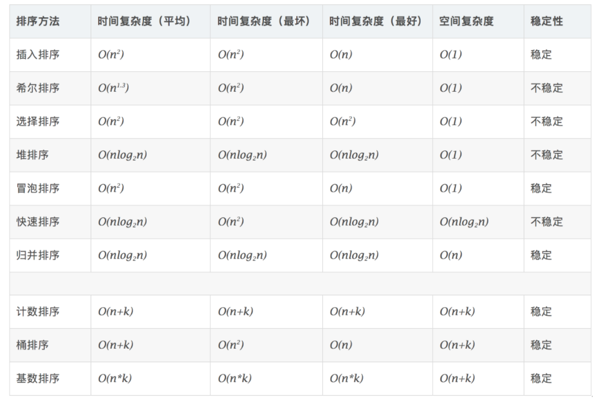

## 排序

#### 1.冒泡排序

从第一对开始，比较相邻的元素大小，比如1与2比，之后2与3。。如果后者比前者小就交换，第一次需要比较n次，第二次就需要比较n-1次==稳定==

#### 2.选择排序

选一个最小的放到最前面==表现最稳定算法之一==

#### 3.插入排序

从第一个数开始，认为其已经排序，然后从后面第二位开始依次加入，如果已排序元素大于待排序元素，将待排序元素进行前移比较，然后找到合适的位置插入==稳定==

#### 4.希尔排序

将元素分组，每次分组数量砍半，例如总共10个数，第一次的间隔为10/2=5，因而可以分5组，然后分别对这五组进行排序，然后把间隔继续砍半，继续排序，直到为1时结束

#### 5.归并排序

将序列分为若干组，初始为1个一组，然后两两合并，对其排序，==排序方法：==比较头部，例如1组合2组，将1组头部与2组比较，将头部小的放入第一位，接着继续比较头部，如果有某一组为空，则直接将另一组push进去。如此循环，