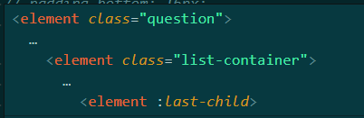

## 小技巧

#### 1.template模板中使用对象和函数

在vue3中无法使用filter，所以当需要对数据进行处理的时候，可以选择传入一个函数（因为函数是有返回值的）

同样的，对于类似下面的需求

```tsx
const examFilters = (item: any) => {
  switch (item.examFinish) {
    case 0:
      return "待考试";
      break;
    case 1:
      return "未参加";
      break;
    case 2:
      return "考试中";
      break;
    case 3:
      return "未通过";
      break;
    case 4:
      return "通过";
      break;
    case 5:
      return "已交卷";
      break;
    default:
      break;
  }

```

这样看起来会很难看，所以可以使用下面的代码：

```ts
enum EXAM_STATUS {
  pending = 0,
  none = 1,
  examing = 2,
  fail = 3,
  pass = 4,
  handle = 5,
}
const examObj: any = {
  [EXAM_STATUS.pending]: "待考试",
  [EXAM_STATUS.none]: "未参加",
  [EXAM_STATUS.examing]: "考试中",
  [EXAM_STATUS.fail]: "未通过",
  [EXAM_STATUS.pass]: "通过",
  [EXAM_STATUS.handle]: "已交卷",
};
```

#### 2.列表懒加载实现

- template

```html
<van-pull-refresh v-model="isUpLoading" @refresh="onRefresh">
      <van-list
        v-model:loading="isDownLoading"
        :finished="finished"
        finished-text="没有更多了"
        @load="onLoad"
      >
        <div v-for="(item, index) in courseList.list" class="courseList">
          <CourseListItem
            :browse-count="item.browseCount"
            :course-cover="item.courseCover"
            :course-name="item.courseName"
            :publish-time="dateFormatter(item.publishTime)"
            :course-center-uuid="item.courseCenterUuid"
            class="courseItem"
            @click="handleClick(index)"
          ></CourseListItem>
        </div>
      </van-list>
</van-pull-refresh>
```

- js

```tsx
const page = reactive({
  pageNo: 1,
  pageSize: 10,
  total: 0,
});
const isUpLoading = ref(false);
const finished = ref(false);
const isDownLoading = ref(false);
const onRefresh = async () => {
  isDownLoading.value = true;
  finished.value = false;
  isUpLoading.value = true;
  console.log("onRefresh");
  page.pageNo = 1;
  courseList.list = [];
  await onLoad(true);
  isDownLoading.value = false;
};
const showListInfo = {
  courseCategoryId: "0",
  courseName: "",
  coursePopularity: 0,
  timeOrder: 0,
};
/**
 * @description:
 * @param {*} isAdd 是否追加数据
 * @return {*}
 */
const onLoad = async (isAdd = true) => {
  try {
    console.log("onLoad");

    const res: any = await showCourseCenterList({
      pageNo: page.pageNo,
      pageSize: page.pageSize,
      ...showListInfo,
    });
    console.log("这是res", res);

    if (isAdd === true) {
      courseList.list.push(...res.data);
    } else {
      courseList.list = res.data;
    }
    isDownLoading.value = false;
    page.total = res.count;
    if (courseList.list.length >= page.total) {
      finished.value = true;
    } else {
      finished.value = false;
      page.pageNo += 1;
    }
    isUpLoading.value = false;
  } catch (error) {
    isUpLoading.value = false;
  }
};
```

其中使用了vant的list和pull

#### 3.父组件传递子组件图片路径出错

- 先把图片`import`进来，再传递就好了

#### 4.需要段落保持换行

需求需要传过来有换行的段落，此时可以使用`<pre>`标签，可以换行，此时对其设置`wihte-space: pre-wrap`

#### 5.获取当前时间戳

`let timestamp = Date.parse(new Date().toString());`

#### 6.git小技巧

`git stash`将自己的代码存到暂存区，此时就可以方便去`git pull`拉取别人的代码

拉去后通过`git stash pop`将代码取出，之后进行修改冲突

#### 7. :last-child

last-child是选择的相较于父元素的最后一个子元素，也就是同级元素。这里面会有坑，比如有一个需求是需要为除了最后一个列表项加上一个底边框。此时列表的容器为`container`，列表项为`for`循环生成的，样式为`list-item`，此时如果要选中最后一个`list-item`，这时候需要通过`.list-item:last-child`来选中最后一个，而不能通过`container :last-child`来获取，注：上面的类似下图效果



看着是差别不大，但实际上选中的东西效果完全不一样。所以`last-child`是进行同级的选中，选择同级的最后一个，告别父元素的思想。

#### 8. keep-alive 和 onActived

如果希望某个组件保持原来的状态和数据，此时可以使用keep-alive，此时不会再次返回该页面的时候组件不会被销毁，也就是说组件不会重新请求数据。与其对应的`onActived`钩子函数只能在keep-alive包裹的组件中使用。当组件激活的时候就会进行回调。此时就可以使用它进行一些特有的数据更新，请求数据。

使用方法：可通过app.vue对keep-alive进行数组式绑定

```vue
<keep-alive :include="['HomePage','Search']">
	<component :is="Component" />
</keep-alive>
```

之后通过额外的 `script`标签将实例进行应用

```vue
<script lang="ts">
import { defineComponent } from "vue";
export default defineComponent({
  name: "Search", //用于keep-alive缓存
});
</script>
```

