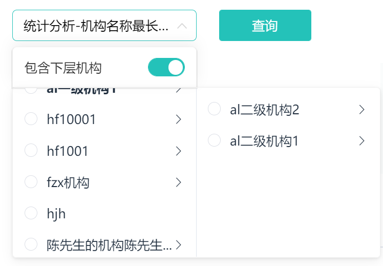

## 小技巧

#### 1.template模板中使用对象和函数

在vue3中无法使用filter，所以当需要对数据进行处理的时候，可以选择传入一个函数（因为函数是有返回值的）

同样的，对于类似下面的需求

```tsx
const examFilters = (item: any) => {
  switch (item.examFinish) {
    case 0:
      return "待考试";
      break;
    case 1:
      return "未参加";
      break;
    case 2:
      return "考试中";
      break;
    case 3:
      return "未通过";
      break;
    case 4:
      return "通过";
      break;
    case 5:
      return "已交卷";
      break;
    default:
      break;
  }

```

这样看起来会很难看，所以可以使用下面的代码：

```ts
enum EXAM_STATUS {
  pending = 0,
  none = 1,
  examing = 2,
  fail = 3,
  pass = 4,
  handle = 5,
}
const examObj: any = {
  [EXAM_STATUS.pending]: "待考试",
  [EXAM_STATUS.none]: "未参加",
  [EXAM_STATUS.examing]: "考试中",
  [EXAM_STATUS.fail]: "未通过",
  [EXAM_STATUS.pass]: "通过",
  [EXAM_STATUS.handle]: "已交卷",
};
```

#### 2.列表懒加载实现

- template

```html
<van-pull-refresh v-model="isUpLoading" @refresh="onRefresh">
      <van-list
        v-model:loading="isDownLoading"
        :finished="finished"
        finished-text="没有更多了"
        @load="onLoad"
      >
        <div v-for="(item, index) in courseList.list" class="courseList">
          <CourseListItem
            :browse-count="item.browseCount"
            :course-cover="item.courseCover"
            :course-name="item.courseName"
            :publish-time="dateFormatter(item.publishTime)"
            :course-center-uuid="item.courseCenterUuid"
            class="courseItem"
            @click="handleClick(index)"
          ></CourseListItem>
        </div>
      </van-list>
</van-pull-refresh>
```

- js

```tsx
const page = reactive({
  pageNo: 1,
  pageSize: 10,
  total: 0,
});
const isUpLoading = ref(false);
const finished = ref(false);
const isDownLoading = ref(false);
const onRefresh = async () => {
  isDownLoading.value = true;
  finished.value = false;
  isUpLoading.value = true;
  console.log("onRefresh");
  page.pageNo = 1;
  courseList.list = [];
  await onLoad(true);
  isDownLoading.value = false;
};
const showListInfo = {
  courseCategoryId: "0",
  courseName: "",
  coursePopularity: 0,
  timeOrder: 0,
};
/**
 * @description:
 * @param {*} isAdd 是否追加数据
 * @return {*}
 */
const onLoad = async (isAdd = true) => {
  try {
    console.log("onLoad");

    const res: any = await showCourseCenterList({
      pageNo: page.pageNo,
      pageSize: page.pageSize,
      ...showListInfo,
    });
    console.log("这是res", res);

    if (isAdd === true) {
      courseList.list.push(...res.data);
    } else {
      courseList.list = res.data;
    }
    isDownLoading.value = false;
    page.total = res.count;
    if (courseList.list.length >= page.total) {
      finished.value = true;
    } else {
      finished.value = false;
      page.pageNo += 1;
    }
    isUpLoading.value = false;
  } catch (error) {
    isUpLoading.value = false;
  }
};
```

其中使用了vant的list和pull

#### 3.父组件传递子组件图片路径出错

- 先把图片`import`进来，再传递就好了

#### 4.需要段落保持换行

需求需要传过来有换行的段落，此时可以使用`<pre>`标签，可以换行，此时对其设置`wihte-space: pre-wrap`

#### 5.获取当前时间戳

- `let timestamp = Date.parse(new Date().toString());`
- `let currentDate = new Date().getTime()`

将字符串转化为时间戳：`let date = new Date('2022-08-30')`

#### 6.git小技巧

`git stash`将自己的代码存到暂存区，此时就可以方便去`git pull`拉取别人的代码

拉去后通过`git stash pop`将代码取出，之后进行修改冲突

git reset --soft HEAD^ 可以撤销上一次的commit，会保存之前的代码

 git remote set-url origin {新地址} 可以改变

#### 7. :last-child

last-child是选择的相较于父元素的最后一个子元素，也就是同级元素。这里面会有坑，比如有一个需求是需要为除了最后一个列表项加上一个底边框。此时列表的容器为`container`，列表项为`for`循环生成的，样式为`list-item`，此时如果要选中最后一个`list-item`，这时候需要通过`.list-item:last-child`来选中最后一个，而不能通过`container :last-child`来获取，注：上面的类似下图效果


看着是差别不大，但实际上选中的东西效果完全不一样。所以`last-child`是进行同级的选中，选择同级的最后一个，告别父元素的思想。

#### 8. keep-alive 和 onActived

如果希望某个组件保持原来的状态和数据，此时可以使用keep-alive，此时不会再次返回该页面的时候组件不会被销毁，也就是说组件不会重新请求数据。与其对应的`onActived`钩子函数只能在keep-alive包裹的组件中使用。当组件激活的时候就会进行回调。此时就可以使用它进行一些特有的数据更新，请求数据。

使用方法：可通过app.vue对keep-alive进行数组式绑定

```vue
<keep-alive :include="['HomePage','Search']">
	<component :is="Component" />
</keep-alive>
```

之后通过额外的 `script`标签将实例进行应用

```vue
<script lang="ts">
import { defineComponent } from "vue";                                                          
export default defineComponent({
  name: "Search", //用于keep-alive缓存
});
</script>
```

#### 9. element ui dialog lable 无法右对齐

将label-width 设为auto，label就会自适应标签的长度，但会默认右对齐(此时使用label-position="left"也无法改变对其方式) 详见：[element ui表单el-form的label自适应宽度并左对齐](https://blog.csdn.net/weixin_43711639/article/details/120871114)

#### 10.vant 轮播图无法自动轮播

在挂载的时候通过手动调用官方提供的实例方法resizse()进行手动触发重绘

#### 11.样式穿透

vue3中可以使用`:deep(.el-drawer__header){}`选中组件的样式进行修改样式

vue2中使用`::deep .el-drawer__header {}`选中组件的样式进行修改样式

#### 12. vue2 ts中使用 ref

以使用element ui 的el-input为例：

在vue2中使用ts跟原生的操作方法类似，区别就是需要指定ref的类型

`import { ElInput } from 'element-ui/types/input';`

此时的场景是


`await nextTick(()=> {(this.$refs.inputRefas ElInput).focus();});`

通过nextTick避免 出现undefine的错误

#### 13.vue2 中从data中渲染图片

有时候需要从data中渲染出本地图片，此时可以通过

```js
{
      label: '用户数',
      url: require('@/assets/operationStatistics/icon_user.png'),
      count: 30358
},
```

通过require进行导入图片

#### 14. vue3 vite中从data中渲染图片

在vue3中没有 `require`，可以通过vite提供的方法进行渲染图片

```js
{
    name: "测验任务",
    icon: new URL("../../assets/home/icon_task.png", import.meta.url).href,
},
```

其中url路径必须是上述路径，不可以是`@/`，识别不出来，详情见 [官方文档](https://cn.vitejs.dev/guide/assets.html)

#### 15. 输入框中禁用空格

`v-model.trim` 这是v-model的修饰符之一

- [`.lazy`](https://cn.vuejs.org/guide/essentials/forms.html#lazy) ——监听 `change` 事件而不是 `input`
- [`.number`](https://cn.vuejs.org/guide/essentials/forms.html#number) ——将输入的合法符串转为数字
- [`.trim`](https://cn.vuejs.org/guide/essentials/forms.html#trim) ——移除输入内容两端空格

#### 16. input只能输入中文

```vue
<el-input
	type="text"
	v-model="setKeyValue"
	ref="inputRef"
	@keyup.enter.native="handleSaveKey(scope.row)"
	:maxlength="4"
	@input="handleInputValue"
/>
```

核心的是`@input处理`handleInputValue

```js
handleInputValue(value) {
    value = value.replace(/[^\u4e00-\u9fa5]/g, '');
    this.setKeyValue = value;
}
```

另有其他输入的正则： [input限制输入正则大全](https://blog.csdn.net/weixin_61570458/article/details/127573090?spm=1001.2101.3001.6650.1&utm_medium=distribute.pc_relevant.none-task-blog-2%7Edefault%7EAD_ESQUERY%7Eyljh-1-127573090-blog-124410737.pc_relevant_3mothn_strategy_and_data_recovery&depth_1-utm_source=distribute.pc_relevant.none-task-blog-2%7Edefault%7EAD_ESQUERY%7Eyljh-1-127573090-blog-124410737.pc_relevant_3mothn_strategy_and_data_recovery&utm_relevant_index=2)

#### 17. 下拉框选中的题型高亮


比如有如上需求，此时可以通过动态绑定class 来将选中的项目进行高亮展示

```vue
<div
     class="question-type-item"
     @click="handleTypeItemClick(index)"
     :class="{ activeItem: queryObj.questionTypeId === index }"
     >
    {{ questionTypeObj[index] }}
</div>
```

此时通过比较选中的项的index与当前vfor渲染的index

#### 18. withDefaults()中传入对象{}

例如：

```ts
interface Props {
  courseList: {
    courseCover: string,
    courseName: string,
  }
}
const props = withDefaults(defineProps<Props>(), {
  courseList : () => ({
    courseCover:  '',
    courseName: '空'
  })
})
```

此时需要传入箭头函数，此时必须要加入`()`，不然对象的`{}`会与箭头函数返回的包裹`{}`冲突

#### 19. 纯文本内容保持原有换行

此时可以使用`<pre/>`标签空白会被浏览器保留，此时pre中的内容会保留原有的换行，但是超过长度不会进行自动换行，此时

添加样式：

```css
pre {
white-space: pre-wrap;
word-wrap: break-word;
}
```

#### 20. 获取ref的type

```ts
const learnListRef1 = $ref<typeof LearningList>()
```

#### 21. 项目中使用icon

- 使用iconfont的icon方案

  ```html
  <icon-font iconName="icon_pack_up_kc" /> // 指定iconName 为项目中的icon名
  ```

- 使用组件库的icon方案

- 下载icon，svg图片

  ```html
  <svg-icon class="icon" name="icon_pf_star" /> // 指定name为svg的名字
  ```

#### 22. 谷歌浏览器排坑

- api.now is not a function 重启谷歌浏览器 

#### 23. 懒加载的坑(多次触底)

懒加载组件可能会触发多次触底事件，原因为

- 请求的数据渲染的高度不够，没法填满整个屏幕
- loading，设为true的时候表示正在加载，此时不会触发触底事件，当数据渲染之后需要手动将其设置为false，所以如果会多次触发触底事件，说明可能是==设为false==的loading放在了渲染数据之前，导致会多次渲染，此时可以可以将loading置为false的操作放在==nextTick()==之后。

#### 24.  vue mixins的使用

 以分页组件为例，如果要使用mixins，首先需要定义一个接口类型，该接口包括了混入预计希望的字段与方法，例：

```ts
export interface ITablePagination {
  tableData: Array<any>;
  page: {
    pageNo: number;
    pageSize: number;
    total: number;
  };
  onSizeChange: Function;
  onCurrentChange: Function;
  pageTableIndex: Function;
}
```

此时定义了两个字段和三个方法，接着就需要在另一个ts文件中去实现这个接口。

```ts
import { pageTableIndex } from '@/utils/common';
import { Component, Vue } from 'vue-property-decorator';
import Pagination from '@/components/pagination/index.vue';
import { ITablePagination } from '@/interface/pagination';
@Component({
  name: 'PageTable',
  components: {
    Pagination
  }
})
export class PageTable extends Vue implements ITablePagination {
  tableData = [];
  page = {
    pageNo: 1,
    pageSize: 10,
    total: 0
  };
  onSizeChange(v) {
    this.page.pageNo = 1;
    this.page.pageSize = v;
    this.onSearch();
  }
  onCurrentChange(v) {
    this.page.pageNo = v;
    this.onSearch();
  }
  pageTableIndex(v) {
    const { pageNo, pageSize } = this.page;
    return pageTableIndex(pageNo, pageSize, v);
  }
  onSearch() {}
}
```

这里面多一个额外的onSearch方法，因为接口的实现是可以多写但是不能少写

接着就是使用该mixins,在父组件中引入该js，之后可以按照正常方式使用组件、在mixins中定义的字段和方法会绑定在vue的实例上（this），如果父组件定义了与mixins相同命名的字段，字段值以父组件的，mixins的值不会覆盖。例：

```vue
import { PageTable } from '@/mixins/Pagination';
import { Component, Mixins } from 'vue-property-decorator';
<pagination
        class="mt20"
        :current-page="page.pageNo"
        :page-size="page.pageSize"
        :total="page.total"
        @size-change="onSizeChange"
        @current-change="onCurrentChange"
></pagination>
export default class TableCourse extends Mixins(PageTable) {}
```

#### 25. 文件下载

- 通过调接口接收到字节流
- 通过Blob对象，将字节流转化为Blob二进制
- 通过`URL.createObjectURL(blob)`生成下载链接
- 动态生成a标签，绑定该下载地址，调用点击事件进行下载

#### 26. 对象数组去重

```js
/**
   * @description: 对象数组去重
   * @param {*} arr 去重对象
   * @param {*} uniId 根据什么去重
   * @return {*}
  */

  uniqueFunc(arr, uniId) {
    const res = new Map();
    return arr.filter(item => !res.has(item[uniId]) && res.set(item[uniId], 1));
}
```

原文：[js对象数组去重的三种方法](https://juejin.cn/post/6984625612937773070)

#### 27. 删除数组中指定对象

```js
let index = arr.indexOf(arr.filter((item) => item.id === obj.id)[0]);
arr.splice(index, 1);
```

原文：[js 数组内删除某个对象（或确定该对象索引值）](https://blog.csdn.net/qq_42543244/article/details/122281545)

#### 28. vue2 中 {{ }} 中使用 import 的方法

import 的方法需要在实例中进行引用，比如

```js
dateFormatter = dateFormatter; // vue2+ts
// vue2+js
methods: {
    dateFormatter,
}

```

#### 29. 卡片css排列方案

有的需求是需要一行排列4个卡片，此时就不能对每个卡片设置padding值，此时可以使用

##### ==该方案已废除！详情实现见34.列表固定间距==

```css
&:nth-child(4n+1){
}
```

对所有卡片设置边距，然后清除4为倍数的卡片边距即可

#### 30. v-show 与 el-cascader 的坑

v-show每次展示的时候都会触发cascader的change事件，同时会清除cascader绑定的值

而v-if就不会，原因是el-cascader的问题，重新渲染组件可以解决。所以不能使用v-show，或者绑定key，当key改变的时候，该组件就会重新渲染。

#### 31. css设定超出宽度展示...

```css
widht: 100px;
overflow: hidden;
text-overflow: ellipsis;
white-space: nowrap;
```

#### 32. ckeditor5使用方法

1. 选择目前需要的编辑器类型，目前可选择的有五种：

   - Classic editor（经典类型）

   - Inline editor（行内）

   - Balloon editor（浮动展示）

   - Ballon block editor（浮动块级展示）

   - Document editor（文档类型）

2. 下载ckeditor5构建文件

   - 预定义方式，可扩展性差，仅做例子展示使用
   - Online builder 在线构建器，通过使用直观的ui来选择需要的功能，之后打包成zip文件下载，此时需要从五种编辑器类型中选择其一。
   - zip download 下载，没用过

3. 使用Online builder 选择需要的功能之后下载

   - 以第二步选择 Classic editor（经典类型）为例，安装 CKEditor5 WYSIYG 编辑组件和当前的编辑器构建工具

     ```npm
     npm install --save @ckeditor/ckeditor5-vue2 @ckeditor/ckeditor5-build-classic
     ```

   - 使用ES6 modules 

     ```js
     // main.js
     import CKEditor from '@ckeditor/ckeditor5-vue2';
     Vue.use( CKEditor );
     ```

   - 使用组件

     ```vue
     <template>
         <div id="app">
             <ckeditor :editor="editor" v-model="editorData" :config="editorConfig"></ckeditor>
         </div>
     </template>
     
     <script>
         import ClassicEditor from '@ckeditor/ckeditor5-build-classic';
     
         export default {
             name: 'app',
             data() {
                 return {
                     editor: ClassicEditor,
                     editorData: '<p>Content of the editor.</p>',
                     editorConfig: {
                         // The configuration of the editor.
                     }
                 };
             }
         }
     </script>
     ```

     

#### 33. ckeditor4 增加音频

基本流程与ckeditor5类似，不需要对ckeditorConfig做其他的配置就可以正常使用

如果希望音频插件可以使用文件上传则需要提供文件上传地址

> By default CKEditor does not include a file browser or uploader. The "Browse server" and "Upload" tabs need server side code to work so they don't appear if there is no file browser or uploader.

默认上传tab页是不做显示的，如果想要显示需要有upload，进行上传，此时可以使用ckfinder，也可以直接增加属性`filebrowserUploadUrl`，指定文件上传地址。此时文件上传就会自动将文件上传到该地址，然后将url进行回显。

#### 34. 列表固定间距 flex gap

有很多场景，需要每个卡片在一个容器中按照间隙进行排列，此时对他们设置边距是不合理的，这种排列方式并不能自适应浏览器窗口。此时可以使用flex gap

```css
.card-list {
  display: flex;
  flex-wrap: wrap;
  gap: 14px;
}
```

#### 35. slot-scope

在vue2.5之前，作用域插槽是用`slot-scope`的，在vue2.6之后引入新的指令`v-slot`，同时可以简写代码`#defalut='{ scope }'`，相较于以前`slot-scope='{ scope }'`

#### 36. 搜索关键词高亮

预期效果如图：

该效果的实现思路是通过正则表达式检索出关键词，之后将关键词替换为带有颜色的span标签，之后通过`v-html`

进行渲染

首先设置v-html

```vue
<h4 class="main-title" v-html="courseTilte" ></h4>
```

字体高亮函数

```ts
/**
 * @description: 字体高亮显示
 * @param {string} result 包含关键词的内容
 * @param {string} keyword 关键词
 * @return {*}
 */
export const useBrightenKeyword = (result:string, keyword:string) =>{
  const Reg = new RegExp(keyword, 'i')
  let res = '';
  if (result) {
    res = result.replace(Reg, `<span style="color: #38BBA9;">${keyword}</span>`)
    return res
  }
}
```

请求到结果之后对关键词内容进行处理

```ts
resultList.data.forEach((element:any) => {
    element.courseName = useBrightenKeyword(element.courseName, inputValue)
});
```

#### 37. el pagination 个数选择器重置

在dialog的 分页组件，dialog被关闭的时候不会被销毁，所以里面的数据都会被保留，此时只能通过手动进行重置，但是el-pagination 是无法手动去改变个数选择器的，所以只能通过修改`key`的方式，让该组件重新渲染。

比如在dialog关闭的时候触发回调`handleCloseDialog`

```ts
handleCloseDialog() {
    this.studentTableData = [];
    this.pageNo = 1;
    this.pageSize = 10;
    // 改变key值
    this.dialogKey = new Date().getTime();
    }
```

#### 38. div实现聚焦失焦

使用场景：手写的input下拉框，因为div没有聚焦`focus`失焦`blur`事件，所以需要进行设置

实现效果：

- 首先select框是通过v-if进行显示隐藏的通过判断`isShowCascader`的值，对select框容器添加`tabindex='0'`即可让该容器获得聚焦失焦的效果

  ```vue
  <div
       class="cascader-container"
       v-if="isShowCascader"
       @click="handleClick"
       >
      <div
           class="cascader-switch"
           @focus="handleFocus"
           @blur="handleBlur"
           tabindex="0"
           ref="cascaderContainerRef"
           >
            <span>包含下层机构</span>
            <el-switch
              v-model="switchValue"
              active-color="#24c2b9"
              inactive-color="#d6d6d6"
            >
            </el-switch>
          </div>
          <el-cascader-panel
            :options="businessOptions"
            @change="handleCascaderChange"
            ref="cascaderRef"
            :props="businessProps"
            v-model="cascaderChoose"
          >
            <template slot-scope="{ data }">
              <Ellipsis
                class="tooltips-container"
                :wordsMax="9"
                :text="data.label"
              />
  
              <!-- {{ data.label }} -->
            </template>
      </el-cascader-panel>
  </div>
  ```

- 通过watch，当select框展示的时候就绑定`focus`，进行手动聚焦

  ```ts
  @Watch('isShowCascader') handleCascaderBlur() {
      if (this.isShowCascader) {
        this.$nextTick(() => {
          console.log('绑定focus');
          (this.$refs.cascaderContainerRef as HTMLInputElement).focus();
        });
        console.log('this.siw');
      }
    }
  ```

- 因为预料外的原因，暂时把focus绑定在了开关上，因为绑定在父级容器上，聚焦还是只能聚焦在开关上（原因未知），所以此时点击下面的select框的时候会触发失焦，失焦就会隐藏select框，此时需要对失焦事件进行一些边界判断

  ```ts
  handleBlur() {
      setTimeout(() => {
        const targetArr = [
          'el-cascader-node__label',
          'el-scrollbar__view el-cascader-menu__list'
        ];
        if (!targetArr.includes(this.currentTargetName)) {
          this.$nextTick(() => {
            this.isShowCascader = false;
          });
        } else {
          this.$nextTick(() => {
            (this.$refs.cascaderContainerRef as HTMLInputElement).focus();
          });
        }
  
        this.currentTargetName = '';
      }, 150);
    }
  ```

  select框使用了饿了么ui的级联选择器，此时通过在父容器绑定点击事件，获取到点击的target对象，对对象进行排除判断，不能点击到select框的选项也失焦。这里面使用了一个==setTimeout==方法，因为会优先触发`blur`事件，然后才会触发`click`事件，所以需要进行延时保证click事件触发成功。==延时时间根据每个电脑原因可能各不相同==

- 增加边界判断，如果点击到select框阻止隐藏

  ```js
  handleClick(target) {
      const targetName =
        target.path[0].className == ''
          ? target.path[2].className
          : target.path[0].className;
      console.log('click', targetName);
      this.currentTargetName = targetName;
    }
  ```

  通过增加targetName来为blur事件回调判断点击事件究竟点击到了哪里，找到容器target的共同点通过className进行判断

#### 39. vue.config.js

Vue cli的cli service提供了`defineConfig`的方法，用于

```js
module.exports = defineConfig({
  transpileDependencies: true
})
```

defineConfig可获得更好的代码提示，与不通过该工具函数用法差别不大

#### 40. git clone 报错 ssh: Could not resolve hostname

可以首先`ping`一下该hostname，让hosts缓存该hostname，再进行git clone

#### 41. 清空数组

`arr.splice(0)`

#### 42. 树形结构过滤关键词

```js
const getDatas = (lists) => {
      const filters = [];
      for (let i = 0; i < lists.length; i++) {
        const item = lists[i];
        if (item.label.includes(this.searchKeyWords)) {
          filters.push(item);
        } else if (item.children) {
          const children = getDatas(item.children);
          if (children.length) {
            filters.push({ ...item, children: children });
          }
        }
      }
      return filters;
    };
```

#### 43. 请求类型 body 与 query

body放在 data里面 query 放在 params里面

