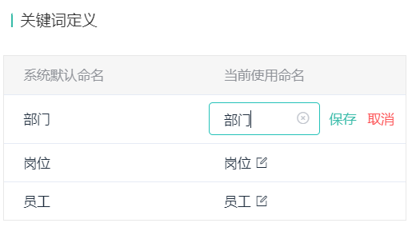
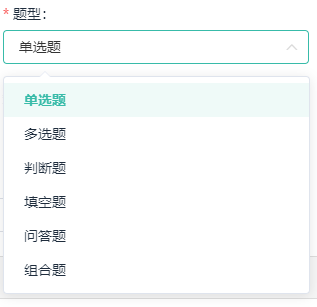

## 小技巧

#### 1.template模板中使用对象和函数

在vue3中无法使用filter，所以当需要对数据进行处理的时候，可以选择传入一个函数（因为函数是有返回值的）

同样的，对于类似下面的需求

```tsx
const examFilters = (item: any) => {
  switch (item.examFinish) {
    case 0:
      return "待考试";
      break;
    case 1:
      return "未参加";
      break;
    case 2:
      return "考试中";
      break;
    case 3:
      return "未通过";
      break;
    case 4:
      return "通过";
      break;
    case 5:
      return "已交卷";
      break;
    default:
      break;
  }

```

这样看起来会很难看，所以可以使用下面的代码：

```ts
enum EXAM_STATUS {
  pending = 0,
  none = 1,
  examing = 2,
  fail = 3,
  pass = 4,
  handle = 5,
}
const examObj: any = {
  [EXAM_STATUS.pending]: "待考试",
  [EXAM_STATUS.none]: "未参加",
  [EXAM_STATUS.examing]: "考试中",
  [EXAM_STATUS.fail]: "未通过",
  [EXAM_STATUS.pass]: "通过",
  [EXAM_STATUS.handle]: "已交卷",
};
```

#### 2.列表懒加载实现

- template

```html
<van-pull-refresh v-model="isUpLoading" @refresh="onRefresh">
      <van-list
        v-model:loading="isDownLoading"
        :finished="finished"
        finished-text="没有更多了"
        @load="onLoad"
      >
        <div v-for="(item, index) in courseList.list" class="courseList">
          <CourseListItem
            :browse-count="item.browseCount"
            :course-cover="item.courseCover"
            :course-name="item.courseName"
            :publish-time="dateFormatter(item.publishTime)"
            :course-center-uuid="item.courseCenterUuid"
            class="courseItem"
            @click="handleClick(index)"
          ></CourseListItem>
        </div>
      </van-list>
</van-pull-refresh>
```

- js

```tsx
const page = reactive({
  pageNo: 1,
  pageSize: 10,
  total: 0,
});
const isUpLoading = ref(false);
const finished = ref(false);
const isDownLoading = ref(false);
const onRefresh = async () => {
  isDownLoading.value = true;
  finished.value = false;
  isUpLoading.value = true;
  console.log("onRefresh");
  page.pageNo = 1;
  courseList.list = [];
  await onLoad(true);
  isDownLoading.value = false;
};
const showListInfo = {
  courseCategoryId: "0",
  courseName: "",
  coursePopularity: 0,
  timeOrder: 0,
};
/**
 * @description:
 * @param {*} isAdd 是否追加数据
 * @return {*}
 */
const onLoad = async (isAdd = true) => {
  try {
    console.log("onLoad");

    const res: any = await showCourseCenterList({
      pageNo: page.pageNo,
      pageSize: page.pageSize,
      ...showListInfo,
    });
    console.log("这是res", res);

    if (isAdd === true) {
      courseList.list.push(...res.data);
    } else {
      courseList.list = res.data;
    }
    isDownLoading.value = false;
    page.total = res.count;
    if (courseList.list.length >= page.total) {
      finished.value = true;
    } else {
      finished.value = false;
      page.pageNo += 1;
    }
    isUpLoading.value = false;
  } catch (error) {
    isUpLoading.value = false;
  }
};
```

其中使用了vant的list和pull

#### 3.父组件传递子组件图片路径出错

- 先把图片`import`进来，再传递就好了

#### 4.需要段落保持换行

需求需要传过来有换行的段落，此时可以使用`<pre>`标签，可以换行，此时对其设置`wihte-space: pre-wrap`

#### 5.获取当前时间戳

`let timestamp = Date.parse(new Date().toString());`

#### 6.git小技巧

`git stash`将自己的代码存到暂存区，此时就可以方便去`git pull`拉取别人的代码

拉去后通过`git stash pop`将代码取出，之后进行修改冲突

#### 7. :last-child

last-child是选择的相较于父元素的最后一个子元素，也就是同级元素。这里面会有坑，比如有一个需求是需要为除了最后一个列表项加上一个底边框。此时列表的容器为`container`，列表项为`for`循环生成的，样式为`list-item`，此时如果要选中最后一个`list-item`，这时候需要通过`.list-item:last-child`来选中最后一个，而不能通过`container :last-child`来获取，注：上面的类似下图效果


看着是差别不大，但实际上选中的东西效果完全不一样。所以`last-child`是进行同级的选中，选择同级的最后一个，告别父元素的思想。

#### 8. keep-alive 和 onActived

如果希望某个组件保持原来的状态和数据，此时可以使用keep-alive，此时不会再次返回该页面的时候组件不会被销毁，也就是说组件不会重新请求数据。与其对应的`onActived`钩子函数只能在keep-alive包裹的组件中使用。当组件激活的时候就会进行回调。此时就可以使用它进行一些特有的数据更新，请求数据。

使用方法：可通过app.vue对keep-alive进行数组式绑定

```vue
<keep-alive :include="['HomePage','Search']">
	<component :is="Component" />
</keep-alive>
```

之后通过额外的 `script`标签将实例进行应用

```vue
<script lang="ts">
import { defineComponent } from "vue";
export default defineComponent({
  name: "Search", //用于keep-alive缓存
});
</script>
```

#### 9. element ui dialog lable 无法右对齐

将label-width 设为auto，label就会自适应标签的长度，但会默认右对齐(此时使用label-position="left"也无法改变对其方式) 详见：[element ui表单el-form的label自适应宽度并左对齐](https://blog.csdn.net/weixin_43711639/article/details/120871114)

#### 10.vant 轮播图无法自动轮播

在挂载的时候通过手动调用官方提供的实例方法resizse()进行手动触发重绘

#### 11.样式穿透

vue3中可以使用`:deep(.el-drawer__header){}`选中组件的样式进行修改样式

vue2中使用`::deep .el-drawer__header {}`选中组件的样式进行修改样式

#### 12. vue2 ts中使用 ref

以使用element ui 的el-input为例：

在vue2中使用ts跟原生的操作方法类似，区别就是需要指定ref的类型

`import { ElInput } from 'element-ui/types/input';`

此时的场景是



`await nextTick(()=> {(this.$refs.inputRefas ElInput).focus();});`

通过nextTick避免 出现undefine的错误

#### 13.vue2 中从data中渲染图片

有时候需要从data中渲染出本地图片，此时可以通过

```js
{
      label: '用户数',
      url: require('@/assets/operationStatistics/icon_user.png'),
      count: 30358
},
```

通过require进行导入图片

#### 14. vue3 vite中从data中渲染图片

在vue3中没有 `require`，可以通过vite提供的方法进行渲染图片

```js
{
    name: "测验任务",
    icon: new URL("../../assets/home/icon_task.png", import.meta.url).href,
},
```

其中url路径必须是上述路径，不可以是`@/`，识别不出来，详情见 [官方文档](https://cn.vitejs.dev/guide/assets.html)

#### 15. 输入框中禁用空格

`v-model.trim` 这是v-model的修饰符之一

- [`.lazy`](https://cn.vuejs.org/guide/essentials/forms.html#lazy) ——监听 `change` 事件而不是 `input`
- [`.number`](https://cn.vuejs.org/guide/essentials/forms.html#number) ——将输入的合法符串转为数字
- [`.trim`](https://cn.vuejs.org/guide/essentials/forms.html#trim) ——移除输入内容两端空格

#### 16. input只能输入中文

```vue
<el-input
	type="text"
	v-model="setKeyValue"
	ref="inputRef"
	@keyup.enter.native="handleSaveKey(scope.row)"
	:maxlength="4"
	@input="handleInputValue"
/>
```

核心的是`@input处理`handleInputValue

```js
handleInputValue(value) {
    value = value.replace(/[^\u4e00-\u9fa5]/g, '');
    this.setKeyValue = value;
}
```

另有其他输入的正则： [input限制输入正则大全](https://blog.csdn.net/weixin_61570458/article/details/127573090?spm=1001.2101.3001.6650.1&utm_medium=distribute.pc_relevant.none-task-blog-2%7Edefault%7EAD_ESQUERY%7Eyljh-1-127573090-blog-124410737.pc_relevant_3mothn_strategy_and_data_recovery&depth_1-utm_source=distribute.pc_relevant.none-task-blog-2%7Edefault%7EAD_ESQUERY%7Eyljh-1-127573090-blog-124410737.pc_relevant_3mothn_strategy_and_data_recovery&utm_relevant_index=2)

#### 17. 下拉框选中的题型高亮



比如有如上需求，此时可以通过动态绑定class 来将选中的项目进行高亮展示

```vue
<div
     class="question-type-item"
     @click="handleTypeItemClick(index)"
     :class="{ activeItem: queryObj.questionTypeId === index }"
     >
    {{ questionTypeObj[index] }}
</div>
```

此时通过比较选中的项的index与当前vfor渲染的index

#### 18. withDefaults()中传入对象{}

例如：

```ts
interface Props {
  courseList: {
    courseCover: string,
    courseName: string,
  }
}
const props = withDefaults(defineProps<Props>(), {
  courseList : () => ({
    courseCover:  '',
    courseName: '空'
  })
})
```

此时需要传入箭头函数，此时必须要加入`()`，不然对象的`{}`会与箭头函数返回的包裹`{}`冲突

#### 19. 纯文本内容保持原有换行

此时可以使用`<pre/>`标签空白会被浏览器保留，此时pre中的内容会保留原有的换行，但是超过长度不会进行自动换行，此时

添加样式：

```css
pre {
white-space: pre-wrap;
word-wrap: break-word;
}
```

#### 20. 获取ref的type

```ts
const learnListRef1 = $ref<typeof LearningList>()
```

#### 21. 项目中使用icon

- 使用iconfont的icon方案

  ```html
  <icon-font iconName="icon_pack_up_kc" /> // 指定iconName 为项目中的icon名
  ```

- 使用组件库的icon方案

- 下载icon，svg图片

  ```html
  <svg-icon class="icon" name="icon_pf_star" /> // 指定name为svg的名字
  ```

#### 22. 谷歌浏览器排坑

- api.now is not a function 重启谷歌浏览器 

#### 23. 懒加载的坑

懒加载组件可能会触发多次触底事件，原因为

- 请求的数据渲染的高度不够，没法填满整个屏幕
- loading，设为true的时候表示正在加载，此时不会触发触底事件，当数据渲染之后需要手动将其设置为false，所以如果会多次触发触底事件，说明可能是==设为false==的loading放在了渲染数据之前，导致会多次渲染，此时可以可以将loading置为false的操作放在==nextTick()==之后。

#### 24.  vue mixins的使用

 以分页组件为例，如果要使用mixins，首先需要定义一个接口类型，该接口包括了混入预计希望的字段与方法，例：

```ts
export interface ITablePagination {
  tableData: Array<any>;
  page: {
    pageNo: number;
    pageSize: number;
    total: number;
  };
  onSizeChange: Function;
  onCurrentChange: Function;
  pageTableIndex: Function;
}
```

此时定义了两个字段和三个方法，接着就需要在另一个ts文件中去实现这个接口。

```ts
import { pageTableIndex } from '@/utils/common';
import { Component, Vue } from 'vue-property-decorator';
import Pagination from '@/components/pagination/index.vue';
import { ITablePagination } from '@/interface/pagination';
@Component({
  name: 'PageTable',
  components: {
    Pagination
  }
})
export class PageTable extends Vue implements ITablePagination {
  tableData = [];
  page = {
    pageNo: 1,
    pageSize: 10,
    total: 0
  };
  onSizeChange(v) {
    this.page.pageNo = 1;
    this.page.pageSize = v;
    this.onSearch();
  }
  onCurrentChange(v) {
    this.page.pageNo = v;
    this.onSearch();
  }
  pageTableIndex(v) {
    const { pageNo, pageSize } = this.page;
    return pageTableIndex(pageNo, pageSize, v);
  }
  onSearch() {}
}
```

这里面多一个额外的onSearch方法，因为接口的实现是可以多写但是不能少写

接着就是使用该mixins,在父组件中引入该js，之后可以按照正常方式使用组件、在mixins中定义的字段和方法会绑定在vue的实例上（this），如果父组件定义了与mixins相同命名的字段，字段值以父组件的，mixins的值不会覆盖。例：

```vue
import { PageTable } from '@/mixins/Pagination';
import { Component, Mixins } from 'vue-property-decorator';
<pagination
        class="mt20"
        :current-page="page.pageNo"
        :page-size="page.pageSize"
        :total="page.total"
        @size-change="onSizeChange"
        @current-change="onCurrentChange"
></pagination>
export default class TableCourse extends Mixins(PageTable) {}
```

