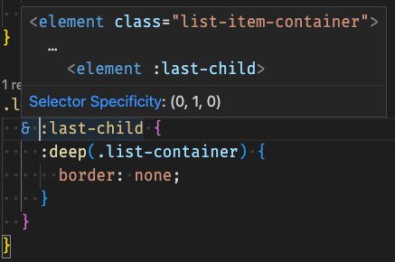
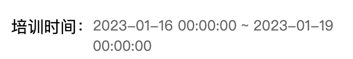
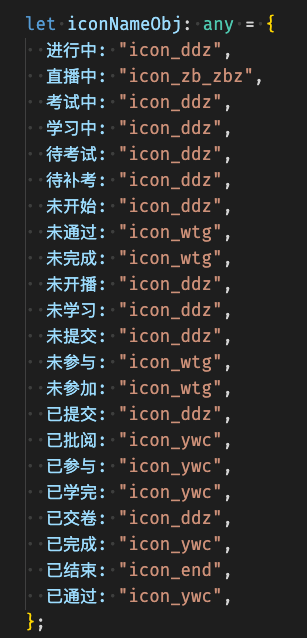
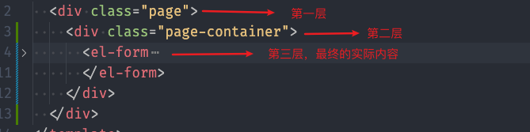

## 小技巧

#### 1.template模板中使用对象和函数

在vue3中无法使用filter，所以当需要对数据进行处理的时候，可以选择传入一个函数（因为函数是有返回值的）

同样的，对于类似下面的需求

```tsx
const examFilters = (item: any) => {
  switch (item.examFinish) {
    case 0:
      return "待考试";
      break;
    case 1:
      return "未参加";
      break;
    case 2:
      return "考试中";
      break;
    case 3:
      return "未通过";
      break;
    case 4:
      return "通过";
      break;
    case 5:
      return "已交卷";
      break;
    default:
      break;
  }

```

这样看起来会很难看，所以可以使用下面的代码：

```ts
enum EXAM_STATUS {
  pending = 0,
  none = 1,
  examing = 2,
  fail = 3,
  pass = 4,
  handle = 5,
}
const examObj: any = {
  [EXAM_STATUS.pending]: "待考试",
  [EXAM_STATUS.none]: "未参加",
  [EXAM_STATUS.examing]: "考试中",
  [EXAM_STATUS.fail]: "未通过",
  [EXAM_STATUS.pass]: "通过",
  [EXAM_STATUS.handle]: "已交卷",
};
```

#### 2.列表懒加载实现

- template

```html
<van-pull-refresh v-model="isUpLoading" @refresh="onRefresh">
      <van-list
        v-model:loading="isDownLoading"
        :finished="finished"
        finished-text="没有更多了"
        @load="onLoad"
      >
        <div v-for="(item, index) in courseList.list" class="courseList">
          <CourseListItem
            :browse-count="item.browseCount"
            :course-cover="item.courseCover"
            :course-name="item.courseName"
            :publish-time="dateFormatter(item.publishTime)"
            :course-center-uuid="item.courseCenterUuid"
            class="courseItem"
            @click="handleClick(index)"
          ></CourseListItem>
        </div>
      </van-list>
</van-pull-refresh>
```

- js

```tsx
const page = reactive({
  pageNo: 1,
  pageSize: 10,
  total: 0,
});
const isUpLoading = ref(false);
const finished = ref(false);
const isDownLoading = ref(false);
const onRefresh = async () => {
  isDownLoading.value = true;
  finished.value = false;
  isUpLoading.value = true;
  console.log("onRefresh");
  page.pageNo = 1;
  courseList.list = [];
  await onLoad(true);
  isDownLoading.value = false;
};
const showListInfo = {
  courseCategoryId: "0",
  courseName: "",
  coursePopularity: 0,
  timeOrder: 0,
};
/**
 * @description:
 * @param {*} isAdd 是否追加数据
 * @return {*}
 */
const onLoad = async (isAdd = true) => {
  try {
    console.log("onLoad");

    const res: any = await showCourseCenterList({
      pageNo: page.pageNo,
      pageSize: page.pageSize,
      ...showListInfo,
    });
    console.log("这是res", res);

    if (isAdd === true) {
      courseList.list.push(...res.data);
    } else {
      courseList.list = res.data;
    }
    isDownLoading.value = false;
    page.total = res.count;
    if (courseList.list.length >= page.total) {
      finished.value = true;
    } else {
      finished.value = false;
      page.pageNo += 1;
    }
    isUpLoading.value = false;
  } catch (error) {
    isUpLoading.value = false;
  }
};
```

其中使用了vant的list和pull

#### 3.父组件传递子组件图片路径出错

- 先把图片`import`进来，再传递就好了

#### 4.需要段落保持换行

需求需要传过来有换行的段落，此时可以使用`<pre>`标签，可以换行，此时对其设置`wihte-space: pre-wrap`

#### 5.获取当前时间戳

- `let timestamp = Date.parse(new Date().toString());`
- `let currentDate = new Date().getTime()`

将字符串转化为时间戳：`let date = new Date('2022-08-30')`

比较日期大小，可以直接通过`let date1 = new Date(2019,1,1)`，`let date2 = new Date(2019,2,1)`

`console.log(date1 < date2)`,Date类型的valueof被重写后返回的是日期的毫秒表示

#### 6.git小技巧

`git stash`将自己的代码存到暂存区，此时就可以方便去`git pull`拉取别人的代码

拉去后通过`git stash pop`将代码取出，之后进行修改冲突

git reset --soft HEAD^ 可以撤销上一次的commit，会保存之前的代码

 git remote set-url origin {新地址} 可以改变remote的地址

git 合并分支 比如我想从 master 分支合并到test分支，此时我需要进入test分支，然后git merge origin/master

就可以把master分支的代码合并到test上面

如果只是git pull遇到冲突，可以切换到其他分支，更新后删除那个冲突的分支`git branch v4.0.0 -D`，之后就可以正常切换到`v4.0.0`拉代码了

如果代码提交错分支了，可以通过git cherry-pick {id} 拉取改id的改动代码，之后进行push就可以了

```bash
git branch -d localBranchName 删除分支
```

#### 7. :last-child

last-child是选择的相较于父元素的最后一个子元素，也就是同级元素。这里面会有坑，比如有一个需求是需要为除了最后一个列表项加上一个底边框。此时列表的容器为`container`，列表项为`for`循环生成的，样式为`list-item`，此时如果要选中最后一个`list-item`，这时候需要通过`.list-item:last-child`来选中最后一个，而不能通过`container :last-child`来获取，注：上面的类似下图效果


看着是差别不大，但实际上选中的东西效果完全不一样。所以`last-child`是进行同级的选中，选择同级的最后一个，告别父元素的思想。

在`sass`中，`&:last-child`与`& :last-child`也有区别

```css
.list-item-container {
  &:last-child {
    :deep(.list-container) {
      border: none;
    }
  }
}
```

此时的可以等同于` <element class='list-item-container' :last-child>`，如果中间加入了空格则：



此外，如果父容器中有其他冗余class ，比如与`list-item-container`还有同级class`list-title`，此时`:last-child`便会失效，此时可以使用`:last-of-type`选择器实现同样效果

#### 8. keep-alive 和 onActived

如果希望某个组件保持原来的状态和数据，此时可以使用keep-alive，此时不会再次返回该页面的时候组件不会被销毁，也就是说组件不会重新请求数据。与其对应的`onActived`钩子函数只能在keep-alive包裹的组件中使用。当组件激活的时候就会进行回调。此时就可以使用它进行一些特有的数据更新，请求数据。

使用方法：可通过app.vue对keep-alive进行数组式绑定

```vue
<keep-alive :include="['HomePage','Search']">
	<component :is="Component" />
</keep-alive>
```

之后通过额外的 `script`标签将实例进行应用

```vue
<script lang="ts">
import { defineComponent } from "vue";                                                          
export default defineComponent({
  name: "Search", //用于keep-alive缓存
});
</script>
```

#### 9. element ui dialog lable 无法右对齐

将label-width 设为auto，label就会自适应标签的长度，但会默认右对齐(此时使用label-position="left"也无法改变对其方式) 详见：[element ui表单el-form的label自适应宽度并左对齐](https://blog.csdn.net/weixin_43711639/article/details/120871114)

#### 10.vant 轮播图无法自动轮播

在挂载的时候通过手动调用官方提供的实例方法resizse()进行手动触发重绘

#### 11.样式穿透

vue3中可以使用`:deep(.el-drawer__header){}`选中组件的样式进行修改样式

vue2中使用`::v-deep .el-drawer__header {}`选中组件的样式进行修改样式

#### 12. vue2 ts中使用 ref

以使用element ui 的el-input为例：

在vue2中使用ts跟原生的操作方法类似，区别就是需要指定ref的类型

`import { ElInput } from 'element-ui/types/input';`

此时的场景是


`await nextTick(()=> {(this.$refs.inputRefas ElInput).focus();});`

通过nextTick避免 出现undefine的错误（某些场景可能需要使用setTimeout）

#### 13.vue2 中从data中渲染图片

有时候需要从data中渲染出本地图片，此时可以通过

```js
{
      label: '用户数',
      url: require('@/assets/operationStatistics/icon_user.png'),
      count: 30358
},
```

通过require进行导入图片

#### 14. vue3 vite中从data中渲染图片

在vue3中没有 `require`，可以通过vite提供的方法进行渲染图片

```js
{
    name: "测验任务",
    icon: new URL("../../assets/home/icon_task.png", import.meta.url).href,
},
```

其中url路径必须是上述路径，不可以是`@/`，识别不出来，详情见 [官方文档](https://cn.vitejs.dev/guide/assets.html)

#### 15. 输入框中禁用空格

`v-model.trim` 这是v-model的修饰符之一

- [`.lazy`](https://cn.vuejs.org/guide/essentials/forms.html#lazy) ——监听 `change` 事件而不是 `input`
- [`.number`](https://cn.vuejs.org/guide/essentials/forms.html#number) ——将输入的合法符串转为数字
- [`.trim`](https://cn.vuejs.org/guide/essentials/forms.html#trim) ——移除输入内容两端空格

#### 16. input只能输入中文

```vue
<el-input
	type="text"
	v-model="setKeyValue"
	ref="inputRef"
	@keyup.enter.native="handleSaveKey(scope.row)"
	:maxlength="4"
	@input="handleInputValue"
/>
```

核心的是`@input处理`handleInputValue

```js
handleInputValue(value) {
    value = value.replace(/[^\u4e00-\u9fa5]/g, '');
    this.setKeyValue = value;
}
```

另有其他输入的正则： [input限制输入正则大全](https://blog.csdn.net/weixin_61570458/article/details/127573090?spm=1001.2101.3001.6650.1&utm_medium=distribute.pc_relevant.none-task-blog-2%7Edefault%7EAD_ESQUERY%7Eyljh-1-127573090-blog-124410737.pc_relevant_3mothn_strategy_and_data_recovery&depth_1-utm_source=distribute.pc_relevant.none-task-blog-2%7Edefault%7EAD_ESQUERY%7Eyljh-1-127573090-blog-124410737.pc_relevant_3mothn_strategy_and_data_recovery&utm_relevant_index=2)

另外：

```vue
<el-input v-model="num" oninput="value=value.replace(/^(0+)|[^\d]+/g,'')" ></el-input>
```

上例为只能输入正整数

只能输入非负整数，且首位不能为0（意外收获，始终有默认值0，input框不会被清空）

```js
handleFormatAmout(value) {
    value = value.replace(/[^\d]/g, '');
    if (value.length > 1 && value[0] == 0) {
      value = value.substr(1);
    }
    this.setKeyValue = value;
  }
```

- 只能输入数字和小数，保留两位小数

```vue
<el-input
        v-model="subject.amount"
        oninput="value=value.replace(/^\D*(\d*(?:\.\d{0,2})?).*$/g, '$1')">
</el-input>
```

此时需要手动对`01`的情况进行单独校验，判断类型为字符串类型，获取到字符串的第一位和第二位进行判断和字符串总长度判断即可

```

```


#### 17. 下拉框选中的题型高亮


比如有如上需求，此时可以通过动态绑定class 来将选中的项目进行高亮展示

```vue
<div
     class="question-type-item"
     @click="handleTypeItemClick(index)"
     :class="{ activeItem: queryObj.questionTypeId === index }"
     >
    {{ questionTypeObj[index] }}
</div>
```

此时通过比较选中的项的index与当前vfor渲染的index

#### 18. withDefaults()中传入对象{}

例如：

```ts
interface Props {
  courseList: {
    courseCover: string,
    courseName: string,
  }
}
const props = withDefaults(defineProps<Props>(), {
  courseList : () => ({
    courseCover:  '',
    courseName: '空'
  })
})
```

此时需要传入箭头函数，此时必须要加入`()`，不然对象的`{}`会与箭头函数返回的包裹`{}`冲突

#### 19. 纯文本内容保持原有换行

此时可以使用`<pre/>`标签空白会被浏览器保留，此时pre中的内容会保留原有的换行，但是超过长度不会进行自动换行，此时

添加样式：

```css
pre {
white-space: pre-wrap;
word-wrap: break-word;
}
```

#### 20. 获取ref的type

```ts
const learnListRef1 = $ref<typeof LearningList>()
                           
// 不建议使用 type LearningListType = InstanceType<typeof LearningList>
// const learnListRef = ref({} as LearningListType)
```

#### 21. 项目中使用icon

- 使用iconfont的icon方案

  ```html
  <icon-font iconName="icon_pack_up_kc" /> // 指定iconName 为项目中的icon名
  ```

- 使用组件库的icon方案

- 下载icon，svg图片

  ```html
  <svg-icon class="icon" name="icon_pf_star" /> // 指定name为svg的名字
  ```

#### 22. 谷歌浏览器排坑

- api.now is not a function 重启谷歌浏览器 

#### 23. 懒加载的坑(多次触底)

懒加载组件可能会触发多次触底事件，原因为

- 请求的数据渲染的高度不够，没法填满整个屏幕
- loading，设为true的时候表示正在加载，此时不会触发触底事件，当数据渲染之后需要手动将其设置为false，所以如果会多次触发触底事件，说明可能是==设为false==的loading放在了渲染数据之前，导致会多次渲染，此时可以可以将loading置为false的操作放在==nextTick()==之后。

#### 24.  vue mixins的使用

 以分页组件为例，如果要使用mixins，首先需要定义一个接口类型，该接口包括了混入预计希望的字段与方法，例：

```ts
export interface ITablePagination {
  tableData: Array<any>;
  page: {
    pageNo: number;
    pageSize: number;
    total: number;
  };
  onSizeChange: Function;
  onCurrentChange: Function;
  pageTableIndex: Function;
}
```

此时定义了两个字段和三个方法，接着就需要在另一个ts文件中去实现这个接口。

```ts
import { pageTableIndex } from '@/utils/common';
import { Component, Vue } from 'vue-property-decorator';
import Pagination from '@/components/pagination/index.vue';
import { ITablePagination } from '@/interface/pagination';
@Component({
  name: 'PageTable',
  components: {
    Pagination
  }
})
export class PageTable extends Vue implements ITablePagination {
  tableData = [];
  page = {
    pageNo: 1,
    pageSize: 10,
    total: 0
  };
  onSizeChange(v) {
    this.page.pageNo = 1;
    this.page.pageSize = v;
    this.onSearch();
  }
  onCurrentChange(v) {
    this.page.pageNo = v;
    this.onSearch();
  }
  pageTableIndex(v) {
    const { pageNo, pageSize } = this.page;
    return pageTableIndex(pageNo, pageSize, v);
  }
  onSearch() {}
}
```

这里面多一个额外的onSearch方法，因为接口的实现是可以多写但是不能少写

接着就是使用该mixins,在父组件中引入该js，之后可以按照正常方式使用组件、在mixins中定义的字段和方法会绑定在vue的实例上（this），如果父组件定义了与mixins相同命名的字段，字段值以父组件的，mixins的值不会覆盖。例：

```vue
import { PageTable } from '@/mixins/Pagination';
import { Component, Mixins } from 'vue-property-decorator';
<pagination
        class="mt20"
        :current-page="page.pageNo"
        :page-size="page.pageSize"
        :total="page.total"
        @size-change="onSizeChange"
        @current-change="onCurrentChange"
></pagination>
export default class TableCourse extends Mixins(PageTable) {}
```

#### 25. 文件下载

- 通过调接口接收到字节流
- 通过Blob对象，将字节流转化为Blob二进制
- 通过`URL.createObjectURL(blob)`生成下载链接
- 动态生成a标签，绑定该下载地址，调用点击事件进行下载

#### 26. 对象数组去重

```js
/**
   * @description: 对象数组去重
   * @param {*} arr 去重对象
   * @param {*} uniId 根据什么去重
   * @return {*}
  */

  uniqueFunc(arr, uniId) {
    const res = new Map();
    return arr.filter(item => !res.has(item[uniId]) && res.set(item[uniId], 1));
}
```

原文：[js对象数组去重的三种方法](https://juejin.cn/post/6984625612937773070)

#### 27. 删除数组中指定对象

```js
let index = arr.indexOf(arr.filter((item) => item.id === obj.id)[0]);
arr.splice(index, 1);
```

原文：[js 数组内删除某个对象（或确定该对象索引值）](https://blog.csdn.net/qq_42543244/article/details/122281545)

#### 28. vue2 中 {{ }} 中使用 import 的方法

import 的方法需要在实例中进行引用，比如

```js
dateFormatter = dateFormatter; // vue2+ts
// vue2+js
methods: {
    dateFormatter,
}

```

#### 29. 卡片css排列方案

有的需求是需要一行排列4个卡片，此时就不能对每个卡片设置padding值，此时可以使用

##### ==该方案已废除！详情实现见34.列表固定间距==

```css
&:nth-child(4n+1){
}
```

对所有卡片设置边距，然后清除4为倍数的卡片边距即可

#### 30. v-show 与 el-cascader 的坑

v-show每次展示的时候都会触发cascader的change事件，同时会清除cascader绑定的值

而v-if就不会，原因是el-cascader的问题，重新渲染组件可以解决。所以不能使用v-show，或者绑定key，当key改变的时候，该组件就会重新渲染。

#### 31. css设定超出宽度展示...

```css
widht: 100px;
overflow: hidden;
text-overflow: ellipsis;
white-space: nowrap;
```

或者使用flex布局，不指定宽度

```css
.flex {
  display: flex;
  .left {
    flex: 1;
    overflow: hidden;
    text-overflow: ellipsis;
    white-space: nowrap;
  }
  .right {
    flex: 0 0 auto;
  }
}
```

css多行超出显示省略号

```css
.text {
   overflow: hidden;
   text-overflow: ellipsis;
   display: -webkit-box;
   -webkit-box-orient: vertical;
   -webkit-line-clamp: 2;
}
```


#### 32. ckeditor5使用方法

1. 选择目前需要的编辑器类型，目前可选择的有五种：

   - Classic editor（经典类型）

   - Inline editor（行内）

   - Balloon editor（浮动展示）

   - Ballon block editor（浮动块级展示）

   - Document editor（文档类型）

2. 下载ckeditor5构建文件

   - 预定义方式，可扩展性差，仅做例子展示使用
   - Online builder 在线构建器，通过使用直观的ui来选择需要的功能，之后打包成zip文件下载，此时需要从五种编辑器类型中选择其一。
   - zip download 下载，没用过

3. 使用Online builder 选择需要的功能之后下载

   - 以第二步选择 Classic editor（经典类型）为例，安装 CKEditor5 WYSIYG 编辑组件和当前的编辑器构建工具

     ```npm
     npm install --save @ckeditor/ckeditor5-vue2 @ckeditor/ckeditor5-build-classic
     ```

   - 使用ES6 modules 

     ```js
     // main.js
     import CKEditor from '@ckeditor/ckeditor5-vue2';
     Vue.use( CKEditor );
     ```

   - 使用组件

     ```vue
     <template>
         <div id="app">
             <ckeditor :editor="editor" v-model="editorData" :config="editorConfig"></ckeditor>
         </div>
     </template>
     
     <script>
         import ClassicEditor from '@ckeditor/ckeditor5-build-classic';
     
         export default {
             name: 'app',
             data() {
                 return {
                     editor: ClassicEditor,
                     editorData: '<p>Content of the editor.</p>',
                     editorConfig: {
                         // The configuration of the editor.
                     }
                 };
             }
         }
     </script>
     ```

     

#### 33. ckeditor4 增加音频

基本流程与ckeditor5类似，不需要对ckeditorConfig做其他的配置就可以正常使用

如果希望音频插件可以使用文件上传则需要提供文件上传地址

> By default CKEditor does not include a file browser or uploader. The "Browse server" and "Upload" tabs need server side code to work so they don't appear if there is no file browser or uploader.

默认上传tab页是不做显示的，如果想要显示需要有upload，进行上传，此时可以使用ckfinder，也可以直接增加属性`filebrowserUploadUrl`，指定文件上传地址。此时文件上传就会自动将文件上传到该地址，然后将url进行回显。

#### 34. 列表固定间距 flex gap

有很多场景，需要每个卡片在一个容器中按照间隙进行排列，此时对他们设置边距是不合理的，这种排列方式并不能自适应浏览器窗口。此时可以使用flex gap

```css
.card-list {
  display: flex;
  flex-wrap: wrap;
  gap: 14px;
}
```

#### 35. slot-scope

在vue2.5之前，作用域插槽是用`slot-scope`的，在vue2.6之后引入新的指令`v-slot`，同时可以简写代码`#defalut='{ scope }'`，相较于以前`slot-scope='{ scope }'`

#### 36. 搜索关键词高亮

预期效果如图：

该效果的实现思路是通过正则表达式检索出关键词，之后将关键词替换为带有颜色的span标签，之后通过`v-html`

进行渲染

首先设置v-html

```vue
<h4 class="main-title" v-html="courseTilte" ></h4>
```

字体高亮函数

```ts
/**
 * @description: 字体高亮显示
 * @param {string} result 包含关键词的内容
 * @param {string} keyword 关键词
 * @return {*}
 */
export const useBrightenKeyword = (result:string, keyword:string) =>{
  const Reg = new RegExp(keyword, 'i')
  let res = '';
  if (result) {
    res = result.replace(Reg, `<span style="color: #38BBA9;">${keyword}</span>`)
    return res
  }
}
```

请求到结果之后对关键词内容进行处理

```ts
resultList.data.forEach((element:any) => {
    element.courseName = useBrightenKeyword(element.courseName, inputValue)
});
```

#### 37. el pagination 个数选择器重置

在dialog的 分页组件，dialog被关闭的时候不会被销毁，所以里面的数据都会被保留，此时只能通过手动进行重置，但是el-pagination 是无法手动去改变个数选择器的，所以只能通过修改`key`的方式，让该组件重新渲染。

比如在dialog关闭的时候触发回调`handleCloseDialog`

```ts
handleCloseDialog() {
    this.studentTableData = [];
    this.pageNo = 1;
    this.pageSize = 10;
    // 改变key值
    this.dialogKey = new Date().getTime();
    }
```

#### 38. div实现聚焦失焦

使用场景：手写的input下拉框，因为div没有聚焦`focus`失焦`blur`事件，所以需要进行设置

实现效果：

- 首先select框是通过v-if进行显示隐藏的通过判断`isShowCascader`的值，对select框容器添加`tabindex='0'`即可让该容器获得聚焦失焦的效果

  ```vue
  <div
       class="cascader-container"
       v-if="isShowCascader"
       @click="handleClick"
       >
      <div
           class="cascader-switch"
           @focus="handleFocus"
           @blur="handleBlur"
           tabindex="0"
           ref="cascaderContainerRef"
           >
            <span>包含下层机构</span>
            <el-switch
              v-model="switchValue"
              active-color="#24c2b9"
              inactive-color="#d6d6d6"
            >
            </el-switch>
          </div>
          <el-cascader-panel
            :options="businessOptions"
            @change="handleCascaderChange"
            ref="cascaderRef"
            :props="businessProps"
            v-model="cascaderChoose"
          >
            <template slot-scope="{ data }">
              <Ellipsis
                class="tooltips-container"
                :wordsMax="9"
                :text="data.label"
              />
  
              <!-- {{ data.label }} -->
            </template>
      </el-cascader-panel>
  </div>
  ```

- 通过watch，当select框展示的时候就绑定`focus`，进行手动聚焦

  ```ts
  @Watch('isShowCascader') handleCascaderBlur() {
      if (this.isShowCascader) {
        this.$nextTick(() => {
          console.log('绑定focus');
          (this.$refs.cascaderContainerRef as HTMLInputElement).focus();
        });
        console.log('this.siw');
      }
    }
  ```

- 因为预料外的原因，暂时把focus绑定在了开关上，因为绑定在父级容器上，聚焦还是只能聚焦在开关上（原因未知），所以此时点击下面的select框的时候会触发失焦，失焦就会隐藏select框，此时需要对失焦事件进行一些边界判断

  ```ts
  handleBlur() {
      setTimeout(() => {
        const targetArr = [
          'el-cascader-node__label',
          'el-scrollbar__view el-cascader-menu__list'
        ];
        if (!targetArr.includes(this.currentTargetName)) {
          this.$nextTick(() => {
            this.isShowCascader = false;
          });
        } else {
          this.$nextTick(() => {
            (this.$refs.cascaderContainerRef as HTMLInputElement).focus();
          });
        }
  
        this.currentTargetName = '';
      }, 150);
    }
  ```

  select框使用了饿了么ui的级联选择器，此时通过在父容器绑定点击事件，获取到点击的target对象，对对象进行排除判断，不能点击到select框的选项也失焦。这里面使用了一个==setTimeout==方法，因为会优先触发`blur`事件，然后才会触发`click`事件，所以需要进行延时保证click事件触发成功。==延时时间根据每个电脑原因可能各不相同==

- 增加边界判断，如果点击到select框阻止隐藏

  ```js
  handleClick(target) {
      const targetName =
        target.path[0].className == ''
          ? target.path[2].className
          : target.path[0].className;
      console.log('click', targetName);
      this.currentTargetName = targetName;
    }
  ```

  通过增加targetName来为blur事件回调判断点击事件究竟点击到了哪里，找到容器target的共同点通过className进行判断
  
  

#### 39. vue.config.js

Vue cli的cli service提供了`defineConfig`的方法，用于

```js
module.exports = defineConfig({
  transpileDependencies: true
})
```

defineConfig可获得更好的代码提示，与不通过该工具函数用法差别不大

#### 40. git clone 报错 ssh: Could not resolve hostname

可以首先`ping`一下该hostname，让hosts缓存该hostname，再进行git clone

#### 41. 清空数组

`arr.splice(0)`

#### 42. 树形结构过滤关键词

```js
const getDatas = (lists) => {
      const filters = [];
      for (let i = 0; i < lists.length; i++) {
        const item = lists[i];
        if (item.label.includes(this.searchKeyWords)) {
          filters.push(item);
        } else if (item.children) {
          const children = getDatas(item.children);
          if (children.length) {
            filters.push({ ...item, children: children });
          }
        }
      }
      return filters;
    };
```

#### 43. 请求类型 body 与 query

body放在 data里面 query 放在 params里面

#### 44. 两边分布布局

例如：

可以使用flex 弹性布局，但是左方的div可能会因为右方div长度过大而造成换行，此时可以对其设置不换行

```css
.study-time {
    white-space: nowrap;
}
```

#### 45. Map的用法，通过键值对更优雅的写法

有的场景是 需要设置icon，但是多个状态会重复对应一个icon，如果通过对象的键值对进行编写，如下



代码会很长很难看，而且可读性很差，此时可以使用Map()

```typescript
let iconNameFormat = () => {
  const m = new Map([
    [['进行中','考试中','学习中','待考试','待补考','未开始','未开播','未学习','未提交','已提交','已交卷'],'icon_ddz'],
    [['直播中'],'icon_zb_zbz'],
    [['未通过','未完成','未参与','未参加'],'icon_wtg'],
    [['已批阅','已参与','已学完','已完成','已通过'],'icon_ywc'],
    [['已结束'],'icon_end']
  ])
  for(const [key,value] of m.entries()) {
    if(key.includes(taskState.value)) {
      return value
    }
  }
}
```

可以将代码从20余行缩短为10余行

#### 46. 背景图片固定铺满浏览器(不随内容滚动)

```css
background: url(@/assets/home/IMG_0020.jpg) no-repeat;
background-size: cover;
background-attachment: fixed;
```

#### 47. el-upload 上传文件报404

需要填写 http-request属性，覆盖默认的上传行为，详情见原文 [element ui el-upload上传文件报404](https://blog.csdn.net/honeymoon_/article/details/122966219)

#### 48. El form label 自适应长度

在使用组件写表单的时候，会经常使用到label 与input ，当有种场景label长度并不固定的时候，此时需要对label进行自适应，但是对`el-form-item`设置`label-width='auto'`的时候，还是会出现`label`与`input`不在同一行的情况，可以使用`flex`布局

`<template #label>{{ domain.label }}</template>`将label通过插槽写出来，对父容器用flex布局，

此时label与input框就会在同一行，但是input框可能不会占满整行，通过

```css
::v-deep .el-form-item__content { // vue2写法
  flex: 2;
}
```

对input容器设置flex:2,让他默认占满剩余容器就可以了

https://ect-iflytek-dev.oss-cn-shenzhen.aliyuncs.com/test/persistent/image/68d6eddc408a4578b6784e6a615c26be.png

#### 49. 对有默认参数的回调函数添加自定义参数

通过`$event`来表示默认参数

```vue
<Switch v-model="switch1" @on-change="change($event,myData)"/>
```

#### 50. 合并两个对象

1. 通过`Object.assign(obj1,obj2)`将obj2合并到obj1中
2. 通过lodash库中的extend方法

#### 51. Vue for循环的key

如果是有引入eslint的话，key是必须要加的，在循环中如果不加key的话，如果存在将for循环的每个小项进行改移动，或者删除的话，就可能会发生意料之外的错误

#### 52. 响应式排错

有时候代码会没有响应式，此时可以但因出来这个值，看有没有Observer属性，vue的响应式通过Observer属性进行对其他属性进行监听，修改后进行更新视图

#### 53. 配置$ref语法糖

在`vite.config.ts`中添加

```json
 vue({
      reactivityTransform: true, // 启用响应式语法糖$ref $computed $toRef
    })
```

此时已经可以使用语法糖了，但是编辑器会报错

配置`tsconfig.json`

```json
  "compilerOptions":{
    ...
    "types": ["vue/ref-macros"] 
  }
```

#### 54. css吸顶效果

通过使用`position:sticky; top: 10px`可以实现到顶之后吸顶`10px`，也需要父容器设置相对定位，`top、left、right、bottom`这四个位置属性是必须要设置的，不然只会处于相对定位 详情见 [css粘性定位](https://juejin.cn/post/6844904199256293384)

#### 55. 动态创建下载文件 修改文件名

```js
onDownload(url,fileName) {
      let self = this;
      let x = new XMLHttpRequest();
      x.open("GET", url, true);
      x.responseType = "blob";
      x.onload = function() {
        //self.exportLoading = false;
        let url = window.URL.createObjectURL(x.response);
        let a = document.createElement("a");
        a.href = url;
        a.download = fileName;
        a.click();
      };
      x.send();
    },
```

#### 56. El-input-number 输入框只读

input有一个`readonly`属性，可以让输入框只读，但是el-input-number中的input是从表面拿不到的，也就是通过在<el-input-number/>标签中添加`readonly`属性是不起效果的，此时可以通过@focus事件，在input获取焦点的时候通过对`input`的dom元素绑定`readonly`

```vue
<el-input-number
              v-model="toolsFormData.uploadCount"
              :min="1"
              :max="2"
              step-strictly
              :step="1"
              controls-position="right"
              @focus="handleLimitNumberInput($event)"
            ></el-input-number>
```

```js
handleLimitNumberInput(event) {
    event.currentTarget.setAttribute('readonly', 'readonly');
  }
```

#### 57. form取消某一项表单的验证

可以通过

```js
this.$nextTick(() => {
      (this.$refs['applicationFormRef'] as any).clearValidate('level.value');
    });
```

来取消props名为`level.value`的验证项的红色警告词

#### 58. vue框架的key

在通过v-for渲染一些频繁改动的组件的时候==**key值不能重复**==是很重要的，不然vue就会发生一些比较奇怪的现象，同时没有报错

#### 59. 引入element 实例的type

Vue 2 ts 

```ts
import type { Form } from 'element-ui'
(this.$refs['form'] as Form).resetFields();
```

Vue3 ts

```ts
//需要先安装Vue Language Features (Volar)和TypeScript Vue Plugin (Volar)
import type { ElForm } from 'element-plus'
type ElFormInstance = InstanceType<typeof ElForm>
const loginForm = ref<ElFormInstance>()
```

#### 60. 裁剪工具

cropperjs 

```vue
<template>
  <el-dialog
    title="图片剪裁"
    :visible="true"
    append-to-body
    @close="closeDialog"
    width="955px"
  >
    <div class="cropper-content">
      <div
        class="cropper"
        style="text-align: center; width: 892px; height: 572px"
      >
        
      </div>
    </div>
    <div slot="footer" class="dialog-footer">
      <el-button @click="closeDialog">取消</el-button>
      <el-button type="primary" @click="finishedCut">上传</el-button>
    </div>
  </el-dialog>
</template>
<script lang="ts">
import { Component, Vue, Prop } from 'vue-property-decorator';
import 'cropperjs/dist/cropper.css';
import Cropper from 'cropperjs';
import { uploadFile } from '@/api/CourseManagement';
@Component({
  name: 'ImgCropper'
})
export default class ImgCropper extends Vue {
  @Prop({
    type: Object,
    required: true,
    default: ''
  })
  imgInfo!: any;
  @Prop({
    type: Function,
    required: false,
    default: () => {}
  })
  callback!: Function;
  @Prop({
    type: Object,
    required: false,
    default: () => {
      return {
        width: 534,
        height: 350
      };
    }
  })
  size!: any;
  private option = {
    img: '', // 裁剪图片的地址
    autoCropWidth: 534, // 默认生成截图框宽度
    autoCropHeight: 350, // 默认生成截图框高度
  };
  private myCropper: any;
  private afterImg: string;
  // 生命周期函数
  async mounted() {
    this.option.img = this.imgInfo.url;
    this.option.autoCropWidth = this.size.width;
    this.option.autoCropHeight = this.size.height;
    await this.$nextTick();
    const image: any = document.getElementById('cropperImg');
    this.myCropper = new Cropper(image, {
      dragMode: 'move',
      initialAspectRatio: this.size.width / this.size.height,
      aspectRatio: this.size.width / this.size.height,
      cropBoxMovable: false,
      cropBoxResizable: false
    });
  }

  private async finishedCut() {
    const name = `${new Date().getTime()}.png`;
    this.afterImg = this.myCropper
      .getCroppedCanvas({
        imageSmoothingQuality: 'high'
      })
      .toDataURL('image/jpg');
    // console.log(this.afterImg);
    const data = this.blobToFile(this.dataURLtoBlob(this.afterImg), name);
    // console.log(data);
    await this.uploadCover(data);
  }

  // 将blob转回file
  private blobToFile(theBlob, fileName) {
    theBlob.lastModifiedDate = new Date();
    theBlob.name = fileName;
    const files = new window.File([theBlob], fileName, { type: theBlob.type });
    return files;
  }

  private closeDialog() {
    this.$emit('close');
  }
  // base64转二进制
  private dataURLtoBlob(dataurl) {
    const arr = dataurl.split(',');
    const mime = arr[0].match(/:(.*?);/)[1];
    const bstr = atob(arr[1]);
    let n = bstr.length;
    const u8arr = new Uint8Array(n);
    while (n--) {
      u8arr[n] = bstr.charCodeAt(n);
    }
    return new Blob([u8arr], { type: mime });
  }
  private uploadCover = async (file: any) => {
    try {
      const formData = new FormData();
      formData.append('file', file);
      formData.append('isConvertPdf', 'false');

      const { data } = await uploadFile(formData);
      this.$emit('up', data);
      this.$emit('close');
    } catch (e) {
      console.log(e);
    }
  };
}
</script>
<style lang="scss" scoped></style>

```

#### 61. 分离或剔除对象某个或某些的属性

通过es6的解构赋值与扩展运算符可以达到不删除某个属性，通过分离的方式获取到需要的属性

```js
const obj = {
          a: 1,
          b: 2,
          c: 3
        }
const { a, ...others } = obj; // others: {b:2,c:3}
```

#### 62. element table的selection属性

table开启多选框的时候，可以退通过 table的selection属性获取到已选的列表值

#### 63. vue Router beforeRouteEnter

对于beforeRouteEnter这个路由的钩子，他检测的并不是地址链接的改变才去触发这个钩子，

#### 64. 获取拓展名

```js
// name为文件名
const [ext, fileName] = name.split(".").reverse();
```

#### 65. 闭包在vue中的应用

例如文件上传

```vue
<van-uploader
                :after-read="uploadFile(taskIndex)"
                :before-read="beforeReadFile(taskIndex)"
                accept=".doc,.docx,.pdf"
              >
                <div class="file-upload-container">
                  <div>
                    <icon-font
                      iconName="icon_add_file"
                      style="width: 16px; height: 16px"
                    ></icon-font>
                    <span>添加文件</span
                    ><span
                      >{{ task.uploadFiles.length }}/{{
                        task.template.count
                      }}</span
                    >
                  </div>
                  <p>请上传pdf、word格式的文件，文件不超过2M</p>
                </div>
              </van-uploader>
```

我希望在`uploadFile`方法中可以传入其他参数进去，此时可以使用闭包

```ts
const uploadFile = (taskIndex: number) => {
  return async (file: any) => {
    const res = await UploadFile(file.file);
    const data = await getPreviewUrl(res.fileId);
    enrollInfo.value.enrollTaskItemEn[taskIndex].uploadFiles.push({
      fileId: data.fileId,
      fileName: data.fileName,
      url: data.previewUrl,
    });
  };
};
```

其中`file`为回调的默认参数，`taskIndex为传入的参数`

#### 66. 通过vue.set()向响应式对象增加新属性

- Vue.set( target, key, value ) / this.$set( target, key, value )
  target：要更改的数据源(可以是对象或者数组)
  key：新增的属性名
  value ：重新赋的值

#### 67. 项目接口反复请求报错问题

排查点：

1. 是否是重复调取某个函数导致很近的时间重复查询某个接口

2. 该页面或者发生影响页面是否是keepAlive状态，如果是keepAlive状态，created()钩子函数需要更改为activated()钩子函数

#### 68. vue3 keepAlive与beforeRouteEnter

首先描述一个场景，在支付场景的表单填写页面，有一个查看支付条款，点击会跳转到其他页面，此时就需要对表单进行keepalive，保留表单的数据。此时就需要通过`beforRouteEnter`路由的钩子函数来判断上一个路由地址，但是在vue3中，`beforeRouteEnter`需要在`setup`函数之前，所以需要使用其他方式

```vue
<script lang="ts">
import { defineComponent, ComponentPublicInstance } from 'vue'

interface IInstance extends ComponentPublicInstance {
  setPathFrom(from: string): void
}

export default defineComponent({
  beforeRouteEnter(to, from, next) {
    next((vm) => {
      const instance = vm as IInstance
      instance.setPathFrom(from.path)
    })
  },
})
</script>

<script lang="ts" setup>
let pathFrom: string
const setPathFrom = (path: string) => {
  pathFrom = path
  console.log('vue-route::from::', pathFrom)
}

defineExpose({ setPathFrom })
</script>
```

通过两个script标签来实现

#### 69. 文件下载

```ts
/*
 * @Description: 文件下载
 * @Author: jmguo2
 * @Date: 2023-04-20 09:52:21
 * @LastEditors: jmguo2
 * @LastEditTime: 2023-04-20 14:22:10
 */
interface DownloadFile {
  url: string;
  filename: string;
}

/**
 * 下载文件函数
 * @param url 文件下载地址
 * @returns Promise，返回 Blob 类型数据
 */
function downloadFile(url: string): Promise<Blob> {
  // 创建 Promise 实例
  return new Promise(function(resolve, reject) {
    // 创建 XMLHttpRequest 实例
    const request = new XMLHttpRequest();
    // 打开请求，使用 GET 方法
    request.open('GET', url);
    // 设置响应数据类型为 blob
    request.responseType = 'blob';
    // 请求成功时触发的事件
    request.onload = function() {
      // 检查请求状态是否为 200
      if (request.status === 200) {
        // 如果状态为 200，将响应数据作为 Promise 的返回值
        resolve(request.response);
      } else {
        // 如果状态为错误，则返回包含错误信息的 Promise
        reject(Error(`Download failed; error code: ${request.statusText}`));
      }
    };
    // 请求失败时触发的事件
    request.onerror = function() {
      // 返回包含错误信息的 Promise
      reject(Error('There was a network error.'));
    };
    // 发送请求
    request.send();
  });
}


export async function downloadFiles(files: DownloadFile[]): Promise<void> {
  try {
    const blobs = await Promise.all(files.map(function(file) {
      return downloadFile(file.url);
    }));
    blobs.forEach(function(blob, index) {
      console.log('看看fileName',files[index].filename);
      
      const filename = files[index].filename;
      saveFile(blob, filename);
    });
  } catch (error) {
    console.log(error);
  }
}

function saveFile(blob: Blob, filename: string): void {
  // 创建Blob对象URL
  const url = URL.createObjectURL(blob);

  // 创建<a>标签并设置其download和href属性
  const a = document.createElement('a');
  a.href = url;
  a.download = filename;

  // 将<a>标签添加到DOM中并触发单击事件
  document.body.appendChild(a);
  a.click();

  // 清除Blob对象URL和<a>标签
  setTimeout(function() {
    window.URL.revokeObjectURL(url);
    document.body.removeChild(a);
  }, 0);
}

```

#### 70. 获取字符串url中的参数（不通过route.query）

场景是通过redirectUrl进行跳转，之后附带参数

```js
const url = '/launch?type=3&enrollTaskId=1481&joinPeopleType=10&channelId=22900';

const params = new URLSearchParams(url);

const enrollTaskId = params.get('enrollTaskId');
const joinPeopleType = params.get('joinPeopleType');
const channelId = params.get('channelId');

console.log(enrollTaskId); // 输出 1481
console.log(joinPeopleType); // 输出 10
console.log(channelId); // 输出 22900
```

坑：在新版本内核中，第一个参数会不识别，结果为null

#### 71. 对于标题，中文英文连在一起，英文过长会换行

```css
word-break: break-all; // 阻止英文换行
```

#### 72. input上传 accept属性的坑

accept属性只是对上传支持的文件作不展示设置，如果此时点击全部文件，还是可以上传其他格式的文件，accept只是更加美观，作为视觉上的屏蔽，但是还是会存在风险

#### 73. 微信浏览器的小屏适配不兼容flex gap

可以使用grid布局

```css
display: grid;
grid-column-gap: 12px;
grid-row-gap: 12px;
grid-template-columns: repeat(auto-fill, 161px);
```

设置每个网格的宽度为161px 设置网格间距

#### 74. 手机浏览器下载拦截问题

安卓手机浏览器只能下载网址从`http或者https`来源的文件，不能是blob或者data格式的链接，safari没有这个问题，此时就会出现下载文件文件名命名为乱码的问题，因为下载的文件名是从下载链接去取的，如果要修改名字需要通过blob格式下载

另一种实现方案就是在后端，可以使用服务端设置 Content-Disposition 响应头的方式来指定文件名。具体做法是在服务器端或后台设置响应头中的 Content-Disposition 属性：

```
Content-Disposition: attachment; filename="example.txt"
```

#### 75. axios终止上传

在Axios中取消上传请求可以通过取消Token来实现。首先，需要创建一个cancelToken对象和相应的取消函数：

```js
const CancelToken = axios.CancelToken;
let cancel;

// 取消请求函数
const cancelUploadRequest = () => {
  if (cancel) {
    cancel('Request canceled.');
  }
}
```

在发起上传请求时，将cancelToken传递给请求对象的cancelToken属性：

```js
axios.post('/upload', formData, {
  cancelToken: new CancelToken(function (c) {
    cancel = c;
  })
})
```

当需要取消请求时，调用cancelUploadRequest函数即可：

```js
cancelUploadRequest();
```

#### 76. 微信浏览器不能下载文件

这个安卓是会提示的，但是ios不会，ios会直接对这个文件进行预览操作，此时如果浏览器预览有问题，则会到网络异常页面，所以需要手动去判断是不是微信浏览器

```js
let ua = navigator.userAgent.toLowerCase();
　　let isWeixin = ua.indexOf('micromessenger') != -1;
　　if (isWeixin) {
   　　 return true;
　　}else{
   　　 return false;      
　　}
```

#### 77. 交换两个变量的值

```javascript
let x = 1;
let y = 2;
[x, y] = [y, x];
```

#### 78. El-date-picker格式化日期，当日0点-当日24点

在@change的时候绑定该事件，项目代码检索码：`格式化时间-formartTime`（可通过该字段检索到代码实现）

```
handleSelectTime([start, end]) {
    // 开始时间需要为当日的0点，结束时间为当日的23:59:59
    const startTime = start + ' 00:00:00';

    console.log('开始时间', startTime);
    const endtime = end + ' 23:59:59';
    if (endtime <= startTime) {
      this.$message.warning('开始时间不能晚于结束时间');
      return;
    }
    console.log('结束时间', endtime);
    this.searchInfo.beginDate = new Date(startTime).getTime();
    this.searchInfo.endDate = new Date(endtime).getTime();
  }
```

#### 79. Css 滚动条不贴边

如果想要滚动条不贴边，需要包三层div

第一层：需要设置高度和overflow:scroll，此时才会有滚动条

第二层：设置居中，表单一般都是居中的

第三层：设置真正的容器，宽度内容等等，此时滚动条就不会贴着表单

```
.page {
  height: calc(100vh - #{$header-height} - #{$crumb-height} - 24px - 80px);
  overflow: scroll;
}
.page-container {
  display: flex;
  justify-content: center;
}
.form-container {
  width: 1200px;
  padding-bottom: 160px;
}
```



#### 80. 手写钩子函数

钩子函数通常应用在类中，列举一个场景：在一个组件中要去new一个文件上传类，通过类进行读取文件信息，每当读取进度有更新，就会通知到组件去更新信息

此时就需要在类中注册一个钩子函数，每当进度更新，就会触发这个钩子函数

之所以不在类中进行钩子函数的实现是因为这个对进度的操作是可变化的，工具类应该具有通用性

此时可以按照步骤：

1、类中定义钩子函数

2、类中根据特定条件触发钩子函数，通过判断钩子函数是否实现`（Object.prototype.toString.call()=== [object Function]）`

3、在组件中实例化该类

4、在组件中注册钩子函数（重写钩子函数）

5、等待触发钩子函数

以下是自己代码实现：

组件中：

```ts
const beforeUpload = async (file: File) => {
  console.log('before-upload');
  // 首先注册钩子函数
  uploader.onProgressUpdate = (progress: any) => {
    console.log('进度',progress);
  }
  const res = await uploader.getHashByFile(file);
  console.log('md5',res);
  // uploader.uploadFile(file)
  return false;
}
```

类中：

```ts
export default class FileUploader {
  private maxThreads: number;
  private chunkSize: number;
  private token: string;
  private prepareUrl: string;
  private completeUrl: string;
  private enableChunking: boolean;

  public onProgressUpdate: Function | undefined = undefined;

  constructor(options: UploadOptions) {
    this.maxThreads = options.maxThreads;
    this.chunkSize = options.chunkSize;
    this.token = options.token;
    this.prepareUrl = options.baseUrl + "/upload/file/storage/prepare";
    this.completeUrl = options.baseUrl + "/upload/file/storage/complete";
    this.enableChunking = options.enableChunking;
  }

  getHashByFile(file: File) {
    return new Promise((resolve, reject) => {
      let fileReader = new FileReader();

      // 1.读取文件，并得到一个ArrayBuffer的对象文件数据
      fileReader.readAsArrayBuffer(file);

      // 2.文件读取完成回调函数
      fileReader.onload = (e) => {
        const buffer = e.target?.result as ArrayBuffer;
        spark.append(buffer);

        // 唯一标识
        const HASH = spark.end();
        resolve(HASH);
      };

      // 2.文件读取进度回调函数
      fileReader.onprogress = (e) => {
        const progress = (e.loaded / file.size) * 100;
        // 此处判断钩子函数是否进行注册
        if(this.onProgressUpdate && Object.prototype.toString.call(this.onProgressUpdate) === "[object Function]") {
          this.onProgressUpdate(progress);
        }
      };
    });
  }
}
```

#### 81.el-form深层次校验

El-form-item里的prop需要prop="monitorSetting.cycle",校验的rules也为'monitorSetting.cycle'

#### 82.pre自动换行

```css
pre {
    white-space: pre-wrap;
    word-wrap: break-word;
}
```

#### 83.虚线分割线

```html
<div class="row-divider"></div>
```

```css
.row-divider {
  width: 1200px;
  border-top: 1px dashed #d9d9d9;
  height: 0;
}
```

#### 84.路由跳转报错navigation canceled...

vue-router - Navigation cancelled from "/" to "/password" with a new navigation

类似这种报错

最简便的方式就是在this.$router.push()后加入.catch(() => {})不能是.catch()

也就是`this.$router.push().catch(()=> {}) `

#### 85.scss文件嵌套样式或者变量等失效

将`@import url("../styles/upload.scss");`改为`@import "../styles/upload.scss";`

#### 86.proxy代理处理数据变化拦截

需求：有个开关e-switch，开启之前进行弹窗提醒

```
  /**
   * @description: 增加代理，代理自动激活属性，在该值修改之前进行拦截
   * @return {*}
   */  
  proxy = new Proxy(this.isOpenAutoActivateParams, this.getAutoActivateHandler())

getAutoActivateHandler() {
    return {
      get: Reflect.get,
      set: (target, property, value) => {
        const updateTarget = () => {
          let fn = value ? this.showOpenPopUp() : this.showClosePopUp();
          fn.then(() => {
            target[property] = value;
          }).catch(() => {
            target[property] = value ? 0 : 1;
          });
        };
        if (
          property === 'isOpenAutoActivate'
        ) {
          updateTarget();
        } else {
          target[property] = value;
        }
        return true;
      }
    };
  }
```

#### 87. El-image预览增加下载

```js
async handlePreview(cert,i) {
        (this.$refs[`cert${cert.certificateHolderId}${i}`] as any)[0].clickHandler();
        await this.$nextTick();
        const wrapper = document.getElementsByClassName('el-image-viewer__actions__inner');
        const downImage = document.createElement('i');
        downImage.setAttribute('class', 'el-icon-download');
        const wrapperElem = wrapper[0];
        wrapperElem.appendChild(downImage);
        if(wrapperElem) {
            downImage.addEventListener('click', async() => {
                this.handleDownload(cert)
            });
        }
    }
    async handleDownload(cert) {
        this.$loading['show']();
        const { certificateName } = cert;
        try {
            this.$loading['hide']();
            downloadFileByUrl(cert.certificateDownloaUrl, `${certificateName}.jpg`);
        } catch(e) {
            this.$loading['hide']();
        }
    }
```

#### 88. 数组换行显示

这是

换行

显示

```js
const arr = ['这是'，'换行','显示']；
arr.join('/n');
```

