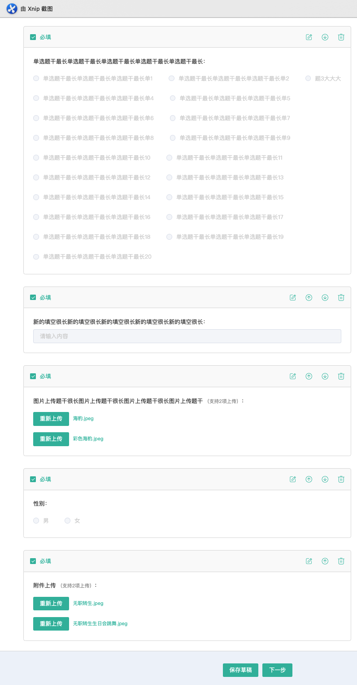
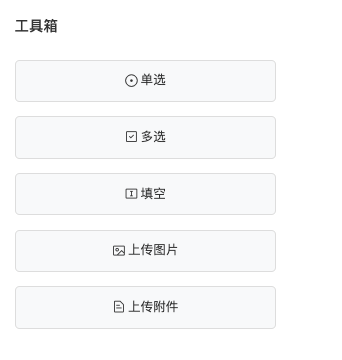
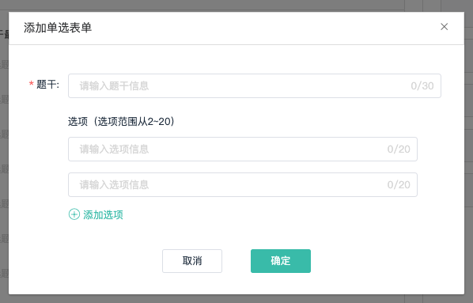

## 新增报名详细设计

> ### 页面结构规划

#### 静态表单项

静态表单项分为6部分

- 报名名称
- 报名说明
- 报名类别
- 报名项目
- 可选级别
- 费用类别

其中 “可选级别”与“费用类别”在选择报名项目后才会进行展示，可选级别默认没有选中，费用类别默认金额为0元。


#### 动态表单项（工具箱项）

动态表单项分为5部分

- 单选
- 多选
- 填空
- 上传图片
- 上传附件



其中单选多选题选项不可以重复，选项范围为2-20，上传图片最大支持两项上传，计数器input框不支持输入修改值。

#### 工具箱

通过点击工具箱中的按钮可以生成动态表单项，点击相应按钮会生成对应的添加弹窗





> ### 组件设计

#### 动态表单组件

实现思路：

- 将动态表单项存放在数组中，通过`v-for`来对数组进行渲染，根据数组中表单项的`type`属性去用`v-if`控制展示表单类型
- 通过改变表单项在数组中的下标值，进行基本的数组操作来实现对动态表单的上移、下移、删除、编辑操作
- 因为需要对列表进行频繁地移动或者删除，所以需要为每一个列表项绑定一个唯一key来确保视图渲染正确
- 编辑会调起工具箱对应弹窗，回显动态表单的数据信息

#### 上传图片组件

支持传递参数：

1. buttonText：上传按钮文本（button按钮在插槽的默认内容中）
2. imgCenter：图片位置居中（因为图片展示在组件内部容器中，需要在组件内部调整图片位置）
3. typeSizeCheckFn：上传校验函数（对文件的类型格式与文件大小进行校验，默认为`jpg,jpeg,png`格式，`3M`大小的图片）

支持插槽：

可以自由调整上传图片点击触发的元素，比如`button`或者`icon`等

```vue
<slot name="uploadInner">
     <el-button type="primary">{{ buttonText }}</el-button>
</slot>
```

图片上传组件使用element的el-upload组件，该组件在上传文件的时候会默认向本地(localhost)发起一次请求，此时会产生404报错，向`el-upload`组件中传入`http-request`属性，创建一个函数return 一个空值即可消除报错

```vue
<template>
  <div>
    <el-upload
      action="#"
      :before-upload="beforeUpload"
      :show-file-list="false"
      :http-request="uploadHttpRequest"
      class="upload-container"
      accept="image/png,image/jpg,image/jpeg,image/gif"
    >
      <div @click="handleClickBtn" :class="{ imgCenter: imgCenter }">
        <slot name="uploadInner">
          <el-button type="primary">{{ buttonText }}</el-button>
        </slot>
      </div>
    </el-upload>
  </div>
</template>
<script lang="ts">
uploadHttpRequest() {
  return;
}
</script>
```

#### 上传附件组件

上传附件组件通过`iframe`引入位于public文件夹下的`webuploader`文件，该组件对课程中心点的文件上传组件增加了一些配置：

1. 支持的文件类型为`pdf,word,image`
2. 可上传文件大小为`3M`
3. 文件上传数量为`1`个

在该组件`mounted()`钩子函数中，定义`iframe`的`onload()`方法，通过`postMessage`向iframe传递参数信息

```js
iframeWin.postMessage(
      {
        cmd: 'openUploadDialog',
        token: UserModule.token,
        host: window['config'].adminServerUrl,
        acceptFileType: ['PDF', 'Word', 'Image'],
        acceptFileSize: 3,
        fileNumLimit: 1
      },
      '*'
);
```


