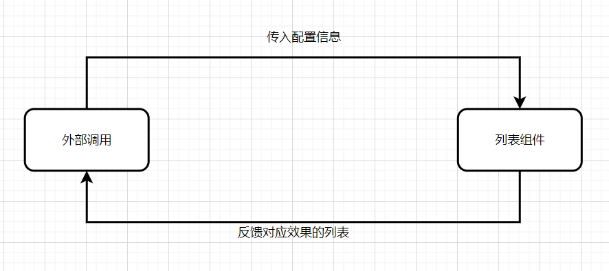
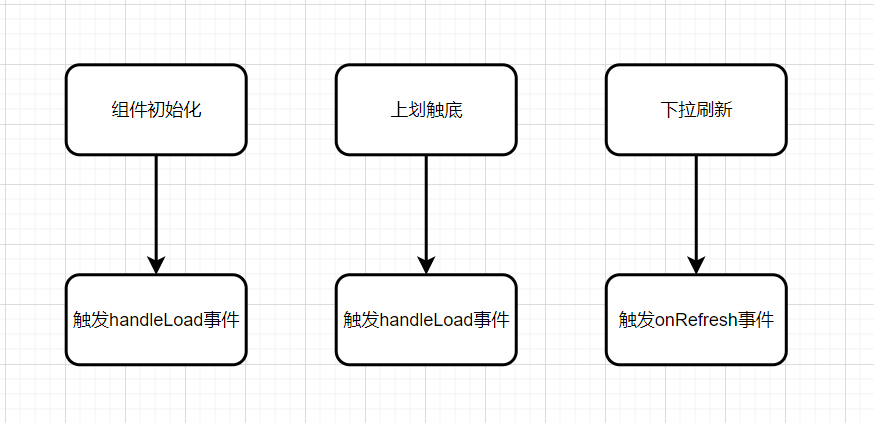
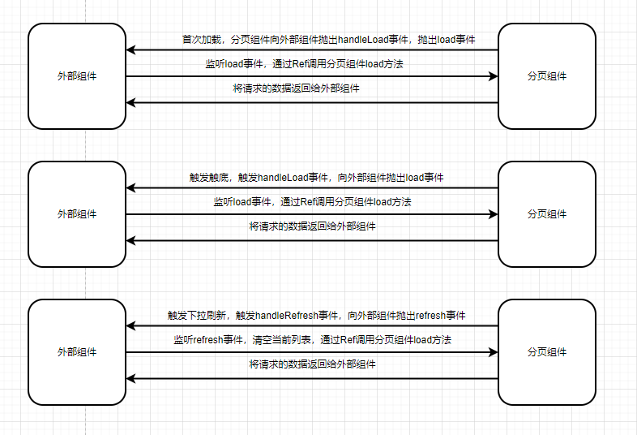

## 通用列表组件、滚动加载分页组件详细设计

> ### 通用列表组件

### 需求背景

*封装原因*

1.项目中很多地方都有用到列表展示，并且列表项的布局相似

2.列表项布局基本分为左中右三部分，按顺序分别为 左部：图片区、标志区；中部：内容区；右部：进入符号区

*需求分析*

1. 可控制列表的内外边距，边框，以及边框圆角
2. 可控制图片的位置（左对齐、右对齐）、是否显示、宽度、高度、图片的边框圆角、图片地址、图片容器高度、图片竖直方向的位置（贴近顶部、居中）
3. 可控制 进入图表、状态标志的显示；左部图片区中，状态标志的位置（距离顶部、左部的距离）


### 最终实现效果展示


### 1.0 整体设计框架

本小节将介绍通用列表组件的设计思路和整体架构

#### 1.0.1 列表组件外部交互流程



- 外部调用组件，传入相应配置，调整列表的样式，以及需要渲染的数据（图片地址、内容标题等）
- 传入配置后 组件显示对应的样式


### 1.1 内部组件具体设计

#### 1.1.1 供外部传入的配置

```js
interface Props {
  listMargin?: string; // 列表外边距
  listPadding?: string; // 列表内边距
  listBorder?: string; // 列表边框
  listBorderRadius?: string; // 列表border-radius
  imgPosition?: string; // 图片位置 "left" or "right"
  isShowImg?: boolean; //是否显示图片
  imgWidth?: string; // 图片宽度
  imgHeight?: string; // 图片高度
  imgContainerHeight?: string; // 图片容器高度
  imgBorderRadius?: string; // 图片border-radius
  imgSrc?: string; // 图片地址
  imgCenter?: boolean; // 图片居中
  isShowArrow?: boolean; // 显示箭头
  isShowBadge?: boolean; // 显示左上角badge
  badgeTop?: string; // 状态距离顶部的位置
  badgeLeft?: string; // 状态距离左边的位置
}
```

#### 1.1.2 组件提供的插槽

- 图片内部标志 badge

```vue
<!-- 图片内部badge开始 -->
<div
	class="badge"
	v-if="props.isShowBadge"
	:style="{ top: props.badgeTop, left: props.badgeLeft }"
	>
	<slot name="badge"></slot>
</div>
<!-- 图片内部badge结束 -->
```

- 中部主要内容

```vue
<!-- 组件主要内容开始 -->
<div class="main">
	<slot name="main"></slot>
</div>
<!-- 组件主要内容结束 -->
```


### 快速上手

本小节将介绍如何在项目中使用 列表组件

*引入*

```vue
<template>
  <div>
    <Listing
      :img-src="props.course.courseCover"
      img-width="119px"
      img-height="77px"
      is-show-arrow
      is-show-badge
      badge-left="-4px"
      class="list-item"
    >
      <template #main>
        <div class="main">
          <h4>{{ course.courseName }}</h4>
          <p>{{ course.validityEndTime }}</p>
          <div class="tags">
            <span>{{ course.studyMethod }}</span
            ><span v-if="props.course.skillFlag">{{ course.skillFlag }}</span>
          </div>
        </div>
      </template>
      <template #badge>
        <div
          class="course-badge"
        >
          <span>{{ course.studyStatus }}</span>
        </div>
      </template>
    </Listing>
  </div>
</template>

<script setup lang="ts">
import Listing from "@/components/Listing.vue";
import { IlistItem } from "@/constants/learningTask";
import { ref } from "vue";

let course:IlistItem = $ref()
</script>
```


> ### 滚动加载分页组件

### 需求背景

*封装原因*

1. 列表的数据量庞大，如果单次全部请求的话，会花费很长的时间，所以需要分页多次进行请求
2. 为用户提供手动刷新的选择

*需求分析*

1. 当用户划到底部，触发加载下一页的列表
2. 用户下拉，刷新当前列表
3. 将请求得到的数据抽离出分页组件，抛出请求的数据给调用组件，只提供必要的触底、刷新事件和分页处理


### 1.0 整体设计框架

本小节将介绍滚动加载分页组件的设计思路和整体框架

#### 1.0.1 分页组件内部交互逻辑



组件内部主要分为三个触发事件

1. 在组件初始化的时候，进行一次`load`加载，触发`handleLoad`事件，向调用组件抛出`load`事件
2. 当上划到触底的时候，触发`handleLoad`事件，向调用组件抛出`load`事件
3. 当监听到用户进行下拉操作的时候，触发`onRefresh`事件，重置分页配置（修改`pageNo`,`pageSize`等）

#### 1.0.2 分页组件外部交互逻辑



外部交互主要分为三部分

1. 首次加载 外部组件监听分页组件的load事件，传入接口地址与请求参数，交于分页组件进行请求，之后分页组件将请求结果返回给外部组件进行数据处理
2. 触发触底 外部组件监听分页组件的load事件，传入接口地址与请求参数，交于分页组件进行请求，之后分页组件将请求结果返回给外部组件进行数据处理
3. 触发下拉刷新，外部组件监听分页组件的refresh事件，处理当前数据，之后调用分页组件load方法，之后将分页组件请求的结果返回给外部组件进行数据处理

### 1.1 内部组件的具体设计

内部组件共有四个方法，抛出三个可供外部调用的方法，这些方法在以下场景会被调用

- 组件内部`load`方法，在内部不会被调用，抛出供外部进行调用，`load`方法负责加载请求新的数据，**需要两个参数**：**请求函数：function、请求参数：params**，之后会进行分页请求，可实现页数的**自增处理**以及**数据的抛出给调用组件**处理。

- 当组件初始化的时候，会触发`handleLoad`事件，抛出`load`事件，表示开始加载数据，此时调用组件方需要去监听该**`load`**事件，获取到返回的数据进行处理。
- 触发触底的时候流程同组件初始化，此时内部组件的`pageNo`会不断自增，请求下一页的数据，直至请求结束
- 上拉刷新，内部组件会触发`handleRefresh`事件，将分页请求的配置进行重置，`pageNo`重置为1等，抛出`refresh`事件，此时调用方组件监听该事件，之后需要手动对数据进行处理，比如清空当前的列表，之后需要通过`Ref`调用`load`方法，重新请求数据，之后流程同第二步。

***设计原因***

1. 请求的数据放在调用组件中而不是放在分页组件中，因为该数据本身是属于调用组件页面的一部分，而不是分页组件的。调用组件可以对请求数据进行格式限制，以及各种灵活的操作。
2. 为了避免通过props传递函数给分页组件，设计就采用了子组件通过`defineExpose`暴露出相对应的函数，外部组件通过Ref的方式去调用子组件的方法去请求数据。

#### 1.1.1 load方法实现

```ts
const load = async (requestFn: Function, params: Object) => {
  return new Promise(async (resolve, rejects) => {
    try {
      isLoading.value = true;
      const res = await requestFn({
        pageNo: page.pageNo,
        pageSize: page.pageSize,
        ...params,
      });
      isRefreshing.value = false;
      page.total = res.count;
      // 数据小于单次请求，避免二次请求
      if (res.count <= page.pageSize) {
        finished.value = true;
      }
      // 数据请求完毕
      if (requestCount * page.pageSize >= page.total) {   
        finished.value = true;
        page.pageNo = 1;
        requestCount = 1;
      } else {
        page.pageNo++;
        requestCount++;
      }
      resolve(res);
      await nextTick();
      isLoading.value = false;
    } catch (error) {
      // 错误
      isLoading.value = false;
      finished.value = true;
      rejects(error);
    }
  });
};
```

`load`方法返回了一个`Promise`，当将请求结果通过`resolve()`返回出去之后，需要等待调用组件将数据列表渲染成功，之后将`isLoading`置为false（表示本次请求结束），否则可能会因为列表渲染不及时导致触发多次触底函数。

*其他*

- 组件提供了一个重置请求参数的方法（`pageNo、isLoading`等字段重置为初始值）

```js
// 重置请求参数，不抛出 refresh事件
const justRefresh = async () => {
  isRefreshing.value = true;
  finished.value = false;
  isLoading.value = true;
  page.pageNo = 1;
  isRefreshing.value = false;
};
```


#### 1.1.2 供外部传入的配置

```vue
const props = defineProps<{
  finishText?: string; // 列表加载结束的提示文字
}>();
```

#### 1.1.3  组件提供的插槽

- 列表内容

```vue
<slot name="list"></slot>
```


### 快速上手

本小节将介绍如何在项目中使用 滚动加载分页组件

*引入*

```vue
<template>
  <div>
    <PageList
      ref="pageListRef"
      @load="handleOnLoad"
      @refresh="handleRefresh"
      finish-text=""
    >
      <template #list>
        <template v-for="course in courseList" :key="course.id">
          {{ course.name }}
        </template>
      </template>
    </PageList>
  </div>
</template>
<script setup lang="ts">
import PageList from "@/views/courseCenter/components/PageList.vue";
import { IlistItem } from "@/constants/learningTask";
import { getTestList } from "@/api/TestController";
import { ref } from "vue";

let courseList: Array<IlistItem> = $ref()
const requestParams = {}
// 触底加载
const handleOnLoad = async  () => {
  getData(getTestList,requestParams)
}
// 下拉刷新
const handleRefresh = () => {
  courseList.splice(0)
  getData(getTestList,requestParams)
}
// 请求数据
const getData = async(queryFn:Function,requestParams:Object) => {
  const { data } = await pageListRef?.load(queryFn,requestParams)
  courseList.push(...data)
}
</script>
```

