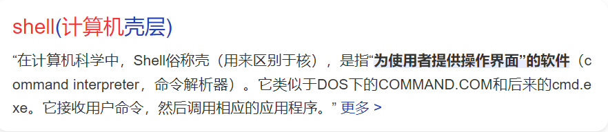
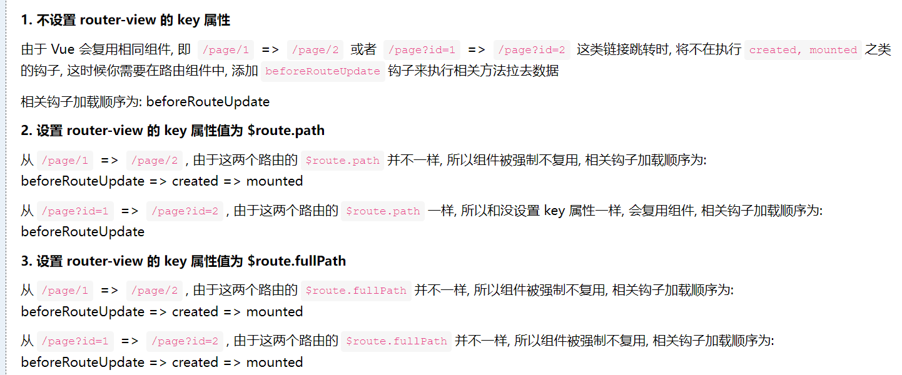

## 项目梳理

#### 1.app.vue

首先是查看是否有shell属性，没有的话进行初始化

window["shell"]表示为

可以理解为通用能力，相当于客户端给前端提供的方法和能力

#### 2.index.vue

登录成功后跳转到paperList页面 此时可以看到试卷包

paperlist有一个routerview，其中一个是试卷包列表，另一个是试卷包的试卷列表

试卷列表是需要试卷包点击试卷详情进行查看的，此时routerview会发生改变

#### 3.router-view中的key

router-view中的key属性

#### 4.项目有更新

首先进入的是`paperList`页面后面的`routerview`中有两个一个是`PaperHome`和`paperAll`其中仿真模拟卷、同步练习、专项突破代码相似度是很高的，可以复用代码抽出来。

#### 5.PaperHome.vue

进入paperHome之后，可以通过点击其中的一个卷子或者联系，进入详情页面。详情页面为`PaperAll.vue`文件此时可以获取到他的参数`id`

#### 6.组件EasyHeader.vue

组件中有三大类，题库资源，成绩记录，错题本默认是进入题库资源的，`paperList`，后面有成绩记录`examRecord`，`errorQuestionRecord`错题本

#### 7.购买逻辑

在shop页的index.vue文件中，将购买页面抽成了一个组件，`PackagePay.vue`，将页面信息传入package组件，之后监听购买事件，然后在packagePay页面中点击支付触发时间传递回父组件进行在线支付的逻辑，同时传回试卷包以及购买信息。

- 之后将payDialogVisible设置为true，打开`ShopPay`组件

#### 8.支付逻辑

1. handleSelectYype确定扫码的类别
   - 在线支付
   - 激活码-提交订单(submitOrder)
     - 激活成功后-

2. 扫码支付埋点trackUsePCQRCode()
3. 创建支付订单createPayOrder()
4. 提交支付订单submitOrder()
   - 如果提交订单成功，开启定时查询初始化，`startIntervalQueryInit()`
5. 查询支付结果，发送请求getQueryOrder()
   - 如果待支付，则延迟两秒继续递归调用queryPayResult()反复进行查询
   - 如果支付成功，修改store，setLoading，setAuthAction，购买成功后刷新试卷包

#### 9.详细购买逻辑

- 在created()阶段初始化包信息，initPackInfo()，初始化包的状态
- 通过调取getListKqPaperPacket()进行获取包的信息
- 在线支付：设置订单包属性_setPackOption()
- 选择支付方式（微信、支付宝）调用handleSelectType()，创建付款订单createPayOrder()
  - 其中createPayOrder()方法中需要传三个参数：productId,orderType,redirectUrl

- 提交付款订单，之后res返回订单号，与二维码qrcode
- 持续查询订单支付结果

