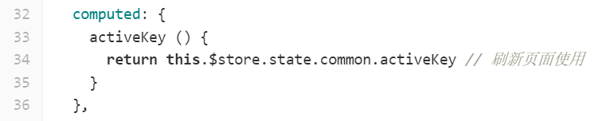
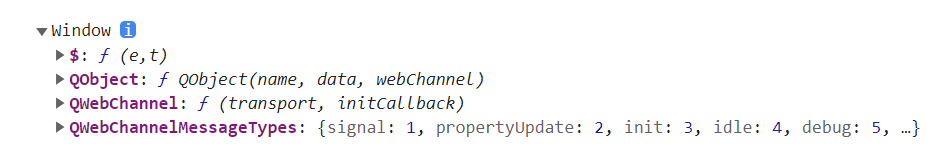
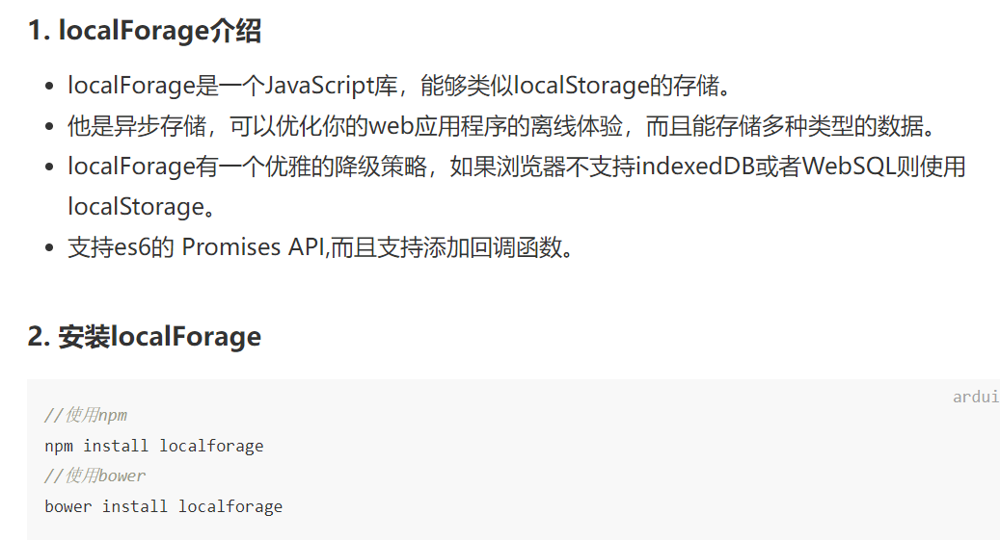
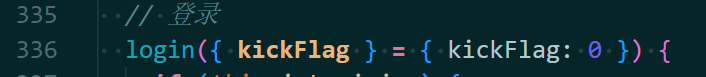

## 考试项目问题

1.app.vue刷新问题

2.

这些属性怎么来的，是.json文件配置的吗，配置是如何影响到这里的

#### 3.

`isBindConnect`是什么，是干什么的

102`systemDaem`是干什么的

#### 4.initsocket不太懂

#### 5.index.vue

223 行localforage()

156 行组件的名字有什么用 @component

220beforeDestroy作用

336 

这个踢出标识是干嘛的